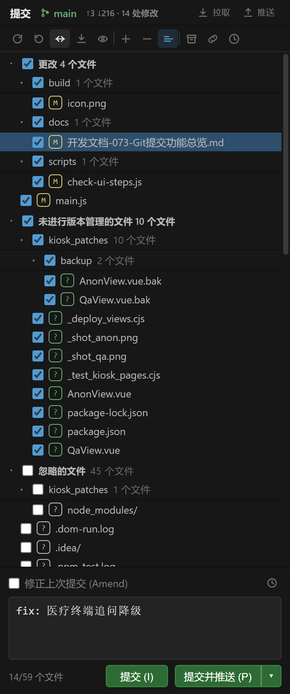
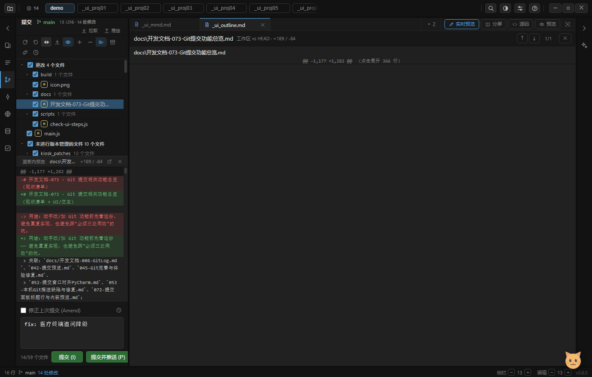
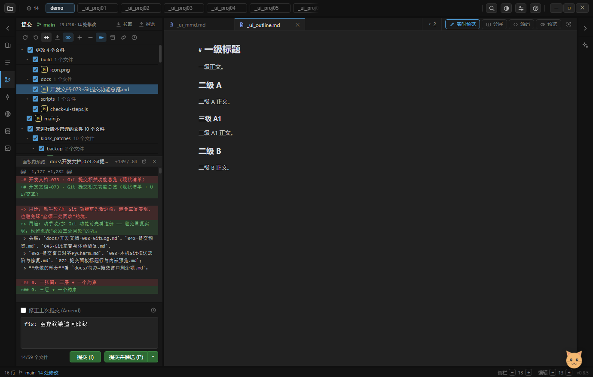
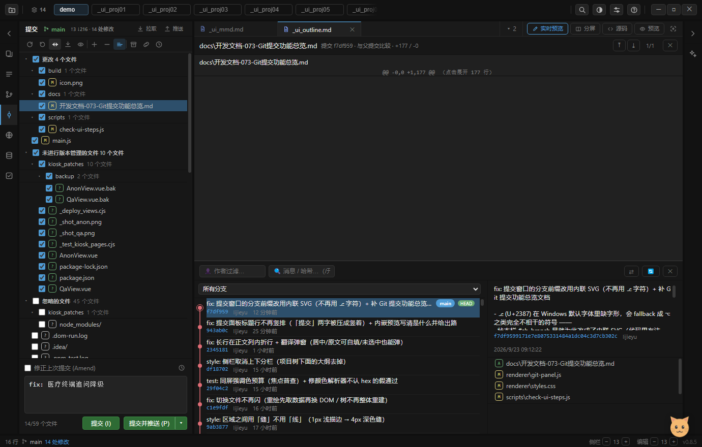

# 开发文档-073 · Git 提交相关功能总览（现状清单 + UI/交互）

> 用途：动手改/加 Git 功能前先看这份 —— 避免重复实现，也避免踩"必须三处同改"的坑。
> 关联：`docs/开发文档-008-GitLog.md`、`042-提交预览.md`、`045-Git完善与体验修复.md`、
> `052-提交窗口对齐PyCharm.md`、`053-本机Git推送缺陷与修复.md`、`072-提交面板标题行与内嵌预览.md`；
> **未做的部分**看 `docs/待办-提交窗口剩余项.md`。

## 0. 三层 + 一个约束

```
渲染层  renderer/git-panel.js（提交窗口）· git-log.js（历史窗口）· viewer/树/标签页右键
   ↓ IPC      preload.js  →  main.js（gitCall(...) + 各 git:* channel）
服务层      git-service.js（纯 Node，**isomorphic-git 1.41.4**，不是原生 git 命令行）
```

**约束**：新增任何 git 能力都要**同时改三处**（`git-service.js` 导出 → `main.js` 的 `ipcMain.handle('git:xxx')` →
`preload.js` 的 `window.myIDE.git.xxx`），并在 `tests/dom.test.js` 的 `myIDE.git` mock 里补一份，
否则自检/单测跑不起来。isomorphic-git **没有** `add -p` / `merge` / `rebase` / hooks / credential helper。

当前 IPC 通道（38 个，`grep -o "ipcMain.handle('git:[a-zA-Z]*'" main.js`）：

```
init status log logGraph commit diffWorkdir diffCommit compareRefs diffRefs commitFiles
branches checkout createBranch discard discardFiles getUserConfig setUserConfig
listRemotes addRemote removeRemote fetch pull push listPushCommits
shelveCreate shelveList shelveApply shelveDelete aheadBehind
listTags createTag revert cherryPick logFile blame
addToGitignore removeFromGitignore listIgnored
```

---

## 1. 入口与快捷键

| 快捷键 | 动作 |
|---|---|
| `Ctrl+K` / `Alt+I` | 打开提交窗口**并聚焦提交消息框**（光标落到末尾） |
| `Alt+0` / `Ctrl+3` / `Ctrl+4` | 只打开提交工具窗口（不抢焦点） |
| `Ctrl+Shift+K` / `Alt+P` / `Ctrl+Alt+K` | 提交并推送 |
| `Alt+9` / `Ctrl+5` | Git 日志窗口 |
| `Shift+Esc` | 关闭日志窗口 |
| `Ctrl+R` | 刷新 Git 状态 |

面板内快捷键（焦点不在输入框时）：`↑` `↓` 移动选中行、`Enter` = 点该行（打开差异）；`Esc` 关闭编辑区的对比视图。
提交消息框内：`Ctrl/Cmd+Enter` = 提交。

其他入口：左侧工具条「提交」图标；状态栏分支名（点击 → 分支与标签弹窗）；
编辑器右键（Blame 注解 / 文件历史）；树与标签页右键（显示历史）。

## 2. UI 展示与交互（逐区域）

### 2.1 整体布局与尺寸

提交窗口是**左侧栏的独占工具窗口**（侧栏默认 340px，可拖 260~480，双击分隔线复位）。
自上而下五段，除列表外都是固定高：

```
┌ 侧栏（默认 340 · 260~480）────────────────────────────────┐
│ 标题行  提交 · 分支 · ↑N↓M · K 处修改                拉取 推送 │ 30px   ← 与标签栏等高
├──────────────────────────────────────────────────────────┤
│ 工具行  刷新 回滚 差异 提交 预览 │ 展开 收起 分组 │ 搁置 远程 日志 │ 按钮 22px，整行 ~30px
├──────────────────────────────────────────────────────────┤
│ 分节行  更改 17 个文件                          （sticky）  │ ~24px
│ 文件行  勾选框 · 徽章 · 文件名 · 父目录（平铺时）        回滚↺ │ ~22px
│ 文件行  …                                                 │
│ 分节行  未进行版本管理的文件 41 个文件                        │
│ 分节行  忽略的文件（默认收起，展开才遍历工作区）                │
│                        ← 这段是唯一可伸缩的区域（flex:1）      │
├──────────────────────────────────────────────────────────┤
│ 内嵌预览（可选）[面板内预览] 文件名 +29/-10      ↗  ✕        │ min 90px / max 42%
│   @@ -1,3 +1,5 @@  /  +新增行  /  -删除行                    │
├──────────────────────────────────────────────────────────┤
│ Amend 行  ☐ 修正上次提交 (Amend)                        🕘  │ ~20px
│ 提交消息  textarea（placeholder「提交消息」）                 │ 52~140px，可纵向拉伸
│ 计数  N/M 个文件 · K 个已暂存      提交 (I)  提交并推送 (P) ▾  │ ~30px
└──────────────────────────────────────────────────────────┘
```

| 元素 | 尺寸 / 样式来源 |
|---|---|
| 标题行 | `--head-h: 30px`；与标签栏、AI 面板标题行**等高**（自检有断言） |
| 工具行按钮 | 高 22px、图标 15px、`gap: 1px`、`padding: 4px 8px`；`flex-wrap` 兜底 |
| 标题行按钮 | 高 20px、图标 14px、无边框、hover 才浮底色 |
| 分节行 | `padding: 6px 10px 3px`、字号 `.85em`、**sticky top 0** 带面板底色 |
| 文件行 | `padding: 3px 10px`、字号 `.92em`、`white-space: nowrap`、文件名中段省略 |
| 状态徽章 | 等宽字体、`min-width: 16px`、`line-height: 14px` |
| 提交消息框 | `min-height: 52px` / `max-height: 140px`、`resize: vertical`、聚焦时描边转强调色 |
| 内嵌预览 | `min-height: 90px` / `max-height: 42%`（面板高度的百分比） |

**实拍图**（下面 4 张随本文一起入库，放在 `docs/img/`；原图由自检生成，
`electron . --check-ui` 会按元素实际位置裁剪 —— 想更新就重跑自检，再把 `check-ui-*.png` 拷进来）：

**① 提交窗口（默认宽度 340px，@2x 放大）** —— 读细节看这张：



**② 提交窗口（内嵌预览开着 + 侧栏拉到最窄 260px）** —— 标题行换行降级、预览框的标签与「在编辑区打开」、右侧编辑区同一个文件的 diff：



**③ 整窗常态** —— 看三栏比例与标题行齐平：



### 2.2 标题行（元素级）

| 元素 | 外观 | 交互 | 备注 |
|---|---|---|---|
| `提交` | 字号 `.92em`、600 字重、正文亮色 | 无 | ⚠ 必须 `white-space: nowrap`：它是 flex 的匿名项，超宽会被压成一字一行（见 072） |
| 分支名 | 绿色、可点、`max-width: 90px` 省略号 | **点击** → 分支与标签弹窗 | 前缀是内联 SVG（不是 `⎇` 字符，Windows 缺字形） |
| `↑N ↓M · K 处修改` | `.85em` 次要色 | hover 出 tooltip：远程地址 + 「已同步远程 / 基于本地缓存（60 秒内不重复联网）」 | 数据来自 `aheadBehind`，是这一行**唯一可压缩项**（`min-width:0` + 省略号） |
| `拉取` / `推送` | 图标 + 文字、无边框 | 点击即执行；推送前先弹「推送预览」 | 图标分别是下箭头 / 上箭头 |

### 2.3 工具行（11 个纯图标按钮）

| # | 图标语义 | tooltip | 启用条件 | 点击行为 |
|---|---|---|---|---|
| 1 | 刷新 | 刷新 Git 状态 (Ctrl+R) | 总是 | 重新 `status` + 重渲染 |
| 2 | 回滚 | 回滚勾选的文件（放弃全部修改；未版本控制的文件会被删除） | 有勾选 | 确认框 → `discardFiles` |
| 3 | 差异 | 显示勾选文件的差异（在编辑区打开） | 有勾选 | 编辑区堆叠显示多个 diff |
| 4 | 提交 | 提交勾选的文件 (Ctrl+Enter) | 有勾选 | 等同底部「提交 (I)」 |
| 5 | 眼睛 | 内嵌预览：开 / 关（tooltip 随状态变化） | 总是 | 切换内嵌预览 |
| 6 | ＋ | 展开全部（目录与分节） | 总是 | 走状态 + 重渲染 |
| 7 | − | 收起全部（目录与分节） | 总是 | 同上，忽略节点会重新懒加载 |
| 8 | 三横线 | 分组方式：按目录 ⇄ 平铺 | 总是 | 写入 `myide-git-ui` |
| 9 | 抽屉 | 搁置更改（Shelve） | 总是 | 搁置弹窗 |
| 10 | 链条 | 远程仓库管理（remote / 认证） | 总是 | 远程弹窗 |
| 11 | 时钟 | 提交历史（Alt+9 / Ctrl+5） | 总是 | 切到日志工具窗口 |

状态样式：默认 `--text-dim` 无底 → **hover** 浮底色 + 正文亮色 → **active（开关开着）** 强调色文字 + 16% 强调色 tint 底 →
**disabled** `opacity: .35` 且 hover 不浮底。按钮**无文字**，说明全在 tooltip（除 `#cp-open` 那类需要直白表述的）。

### 2.4 变更列表

**三个分节**：`更改 N 个文件` / `未进行版本管理的文件 N 个文件` / `忽略的文件`（第三个默认收起）。

```
文件行结构：  [☑ 三态复选框] [M 徽章] [文件名（中段省略）] … [↺ 回滚]
平铺模式下：  [☑] [M] [父目录/] [文件名] … [↺]
```

| 元素 | 交互 | 状态 |
|---|---|---|
| 分节行 | 点箭头展开/收起；点复选框 = 全选/全不选该节 | 复选框三态：全选 / **半选（`indeterminate`）** / 未选 |
| 目录行（按目录模式） | 结构 `▾ ☑ 目录名  12 个文件`，缩进 `8 + depth×14` px；**点行 = 收起/展开**（不选中文件）<br>**点复选框 = 勾/取消该目录下全部文件**（tooltip 带数量） | 同样三态；展开态按目录路径持久化（`dirCollapsed`），「收起全部」写一个全局兜底（`dirAllCollapsed`） |
| 文件行 **单击** | 选中该行 + 打开差异（预览开 → 面板内；关 → 主编辑区） | 行加 `.sel`（`--bg-selected` 实底） |
| 文件行 **双击** | `deleted` 文件直接看 diff（磁盘上已无文件）；其他文件**在编辑器打开** | — |
| 勾选框 | 只改勾选集合，不选中行 | `accent-color: var(--accent)` |
| 悬停 | 行底色变化 + 右侧浮出 `↺` | `↺` 默认 `visibility: hidden`；`↺` 自身 hover 变红 |
| 键盘 | `↑↓` 移动（`key-nav-sel`，自动 scrollIntoView）+ `Enter` = 单击 | 跳过折叠分组里的行 |
| 右键 | 见下 | 位置贴光标、超屏自动内收 |

右键菜单项（按出现顺序）：`🔍 查看差异` / `📂 打开文件`（已删除文件不显示）/ `📋 复制完整路径` /
`🕘 显示历史` / `🚫 添加到 .gitignore` /（忽略行）`✅ 不再忽略（从 .gitignore 移除）` /
`🗄 搁置此更改（Shelve）`（忽略行不显示）。点击菜单外任意处关闭。

**勾选语义（铁律）**：勾选集合是唯一权威 —— 取消勾选 = `resetIndex`（unstage）；
`git add` 带 `force: true`；忽略的文件也能勾选 → 强制加入提交。

### 2.5 内嵌预览（默认关）

| 元素 | 说明 |
|---|---|
| 标签 `面板内预览` | 灰底小标签，tooltip 说明"这是什么 / 怎么关" |
| 文件名 | 省略号 + tooltip 全路径 |
| `+N / -M` | 该文件的增删行数 |
| `↗`（在编辑区打开） | 同一个文件转到主编辑区看整体 —— 面板窄时的出口 |
| `✕` | 关掉预览（回到"点文件在编辑区看差异"） |
| 内容 | 紧凑 unified：`@@ -a,b +c,d @@` 分隔行（sticky）+ `+`/`-`/空格 前缀行；新增绿底、删除红底；`white-space: pre-wrap` 折行 |

### 2.6 提交消息区

| 元素 | 交互 |
|---|---|
| `☐ 修正上次提交 (Amend)` | 勾选 → 自动回填上次提交消息；取消 → 还原原来的输入 |
| `🕘`（消息历史） | 点击弹出浮动菜单（最近 20 条），点一条填进输入框 |
| `提交消息` textarea | 输入即存草稿（防抖，**按项目**）；`Ctrl/Cmd+Enter` 提交 |
| 计数 `N/M 个文件 · K 个已暂存` | 实时联动勾选；无勾选时为空字符串 |
| `提交 (I)` | 主按钮；无勾选时禁用（`opacity: .45`） |
| `提交并推送 (P)` + `▾` | 拆分为「主体 + 下拉」；`▾` 出「其他远程 / 提交并强制推送（--force）」 |

### 2.7 差异视图（主编辑区）

- 头部：文件路径（或 `N 个文件`）· `工作区 vs HEAD · +a / -b` · `⤒`/`⤓` hunk 导航（中间显示 `当前/总数`）· `✕`
- 正文：逐文件堆叠；hunk 分隔行 + 逐行 diff；表格布局、每行带行号列
- 关闭：`✕` 或 `Esc`。打开前若主区被浏览器/依赖图占用会先让位

### 2.8 状态栏 / 编辑器

- 状态栏：`分支名`（点击 → 分支弹窗）+ `N 处修改`；分支前缀是内联 SVG
- 编辑器 gutter Blame：每行显示 `hash 作者 时间`，连续同提交只在首行标注；编辑后自动清空

## 3. 三条典型交互时序

**① 只看一眼改了什么**
`点文件行` → 编辑区出 diff（预览开着则在面板内出）→ `Esc` 关掉。

**② 提交**
`Ctrl+K`（打开窗口 + 光标进消息框）→ 勾选文件（分节/目录复选框可整片勾）→ 写消息 → `Ctrl+Enter`。
提交后：toast 成功 + 列表刷新 + 消息历史记一条。

**③ 提交并推送**
`Ctrl+Shift+K` → 提交 → **推送预览弹窗**（列出待推送提交 + 目标 `远程/分支`）→ 点「⬆ 推送」→ toast → 刷新列表与日志窗口。

## 4. 弹窗一览

| 弹窗 | 入口 | 内容 | 按钮 |
|---|---|---|---|
| 推送预览 | `推送` / `提交并推送` | 「将推送 N 个提交到 origin/分支」+ 提交列表（短哈希 / 消息 / 作者·时间） | `取消` · `⬆ 推送（N 个提交）` |
| 分支与标签 | 标题行分支名 / 状态栏分支 | 顶部「新建分支名…」+ `＋ 新建`；分支列表（点即切换）；标签列表（点即检出，detached HEAD） | 行内点击，`✕` 关 |
| 远程仓库 | 工具行「远程」 | remote 列表（名 + URL，可删）；`origin` + URL + `＋ 添加`；**认证区**：主机 / 用户名 / 密码（按主机保存） | `＋ 添加` · `保存该主机认证` |
| 搁置更改 | 工具行「搁置」/ 右键「搁置此更改」 | 上：名称 + 文件勾选 + `搁置所选`；下：已搁置列表（恢复 / 删除） | 行内按钮 |
| 回滚确认 | 工具行「回滚」 | 列出前 10 个文件 + 未跟踪会被删除的提示 | `确定` / `取消` |
| 提交消息历史 | Amend 行 `🕘` | 最近 20 条消息 | 点一条填入 |

## 5. 反馈文案（toast）

成功：`✅ 已推送 N 个提交到 origin/分支` · `✅ 已创建并切换到分支 X` · `已复制` ·
失败/拦截：`没有勾选的文件` · `勾选的只有被忽略的文件，它们不参与回滚` · `推送失败: <原因>` ·
`请先打开一个文件夹` · `推送中…`（进行中）

## 6. 搁置（Shelve）

后端 `shelveCreate / shelveList / shelveApply / shelveDelete`：文件内容以 base64 存在
**`<repo>/.git/myide-shelves/`**（自实现，不依赖 `git stash`），搁置后会把工作区+暂存区回滚到 HEAD
（HEAD 里已存在的文件走 `discard` + `git.add` 同步 index；新增/未跟踪的直接清 index 并删文件）。

## 7. 分支与标签

`branches` 列分支 → `checkout` 切换；`createBranch` 新建（建完即切）；`listTags` 列标签 → `checkout` 到标签（detached HEAD）。
切换后会刷新日志窗口。

## 8. 远程与凭证

- `listRemotes / addRemote / removeRemote`。
- 凭证**按主机**存 `myide-git-auth-map`：`{host: {username, password}}` —— 多主机（GitHub / Gitea / 内网 GitLab）互不覆盖；
  切换主机输入框时自动预填该主机已存凭证。
- `git-service.js` 里另有代理/隧道与 `systemCredentialFill` 兜底（命令行已记住的凭证可复用）。

## 9. 拉取 / 推送

- **拉取**：`fetch` + fast-forward 合并 origin。
- **推送**：先弹「推送预览」（`listPushCommits`），确认后 `pushRemote({remote, force})`；
  失败给友好错误（`friendlyNetError`），远程 URL 缺 `.git` 会自动补并提示。
- `↑N ↓M` 每 60 秒才联网一次，`拉取/推送` 手动 force fetch。

## 10. Git 日志窗口（`git-log.js`，`Alt+9`）

**底部停靠**的面板（不是右侧），上下高度可拖、左右宽度可拖（比例存 `myide-gl-right-pct`）。
工具栏：作者过滤 / 消息·哈希搜索（`/` 开头当正则）/ 文件历史 chip / 命中计数 / refs 下拉 / `⇄` 分支对比 / 刷新 / 关闭。



| 区域 | 内容 |
|---|---|
| 左：提交图 | 同高行内画 gitk 式车道 SVG（`buildGraph` 状态机 + `buildGraphSvg`） |
| 左：列表 | 提交行（消息 + refs 徽章 + HEAD 标记 + 短哈希 / 作者 / 时间），选中行加 `.sel` |
| 顶部 | refs 下拉：所有分支 / 当前分支 / 各分支（标签在提交行徽章与分支弹窗里）；`⇄` 分支对比 |
| 右：详情 | 提交头（完整消息 + 作者 + 时间 + 哈希）→ 变更文件列表（徽章 + 文件名）→ 点文件看逐文件 diff（`diffCommit`） |
| 右键提交 | `↩ 还原此提交（Revert）` / `🍒 摘取此提交（Cherry-pick）` / `🏷 在此提交上新建标签` / `📋 复制完整哈希` / `📋 复制提交消息` |
| 分支对比 | 选两个 ref → `compareRefs`（只有 A / 只有 B / 两侧都有）→ 点文件看 `diffRefs` |
| 文件历史 | 树 / 标签页 / 文件行右键「显示历史」→ 过滤到该文件（`logFile`），顶部 chip 可退出 |

## 11. 编辑器里的 Git

- **Blame 注解**：编辑器右键 → gutter 显示每行 `hash 作者 时间`（`blame`）；连续同提交只标首行；
  「未提交」行有专门标记；**编辑文档后自动清空**（否则行号会错位）。
- **文件历史**：编辑器右键 / 树右键 / 标签页右键 → 打开日志窗口并过滤到该文件。

## 12. 状态栏

`分支名`（点击 → 分支与标签弹窗）+ `N 处修改`。

## 13. AI 助手集成

斜杠命令 **`/生成提交信息`**：把工作区改动（`status` + diff 摘要）作为上下文塞进对话，
并预填指令「按 `<类型>: <中文说明>` 格式写一条提交信息，类型用 feat/fix/docs/refactor/test/chore」，
只输出信息本身。

## 14. 明确还没做的（见 `docs/待办-提交窗口剩余项.md`）

Changelist（PyCharm 变更列表，体量最大）· hunk 级暂存/取消暂存（部分提交）·
合并冲突节点与解决 · 提交前检查（Before Commit）· Sign-off / 作者覆盖 · 若干小项。

> 根因都在"用的是 isomorphic-git，没有原生 index 操作能力"—— 但对象读写
> （`writeBlob/hashBlob/updateIndex/resetIndex/readBlob`）是有的，所以 hunk 暂存**能做**，只是要自研。

## 15. 验证基线

- `npm test`：语法 26 + `git.test.js` 45 + `dom.test.js` 241
- `electron . --check-ui`（headless）：`check-ui-out.txt` **323 项全绿** / 3 项 headless 跳过；自检步骤 34 个
- 提交窗口相关截图：`check-ui-1c-commit-panel.png`（第一轮）、`check-ui-1d-commit-parity.png`（PyCharm 对齐）、
  `check-ui-1n-commit-narrow.png`（最窄侧栏 + 内嵌预览）
