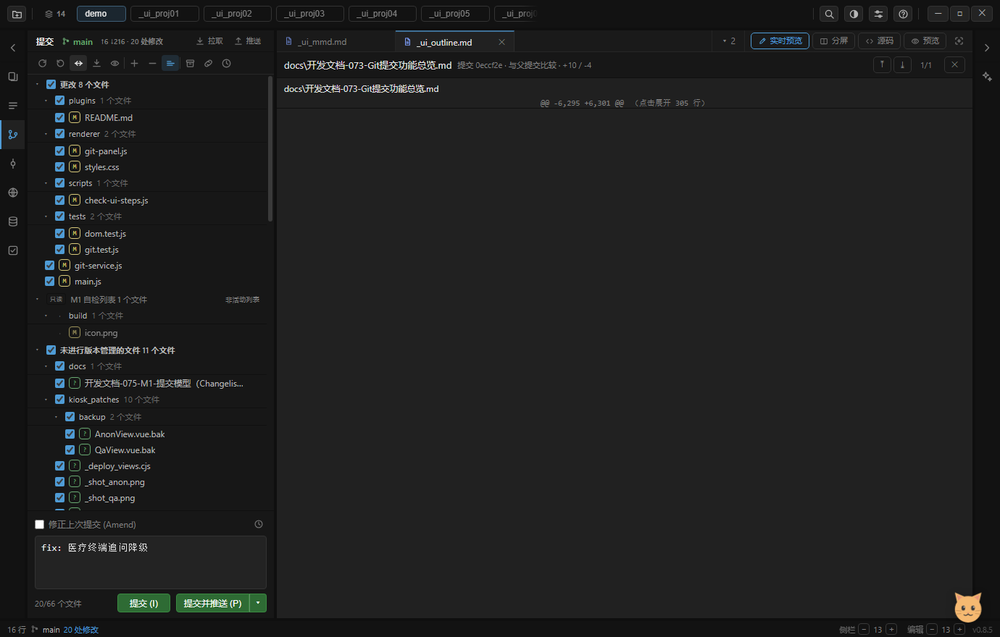

# 开发文档-075 · M1 提交模型：Changelist + 「提交选择」与暂存区解耦

> 依据：用户拍板的 M1 范围 —— **命名分组 + 活动列表 + 持久化 + 修误 unstage + Staged 只读视图**，
> 并明确「绝对不加 Stage/Unstage 按钮」「接受本机 Git 软依赖」「不先做 selection/index 架构重构」。
> 关联：`docs/开发文档-074-Git下一阶段路线图（评审回应）.md`（M1 在五阶段里的位置）。

## 0. 一句话

M1 动的是**提交语义**，不是 Git 后端：**勾选集合仍然决定"这次提交带走什么"，
但提交过程不再破坏用户的暂存区**；另外把"选择"这一层显式化成变更列表，并把 index 里已有的内容单独展示出来。

## 1. 核心：提交事务（`git-service.js` commit()）

### 1.1 为什么"不再调用 resetIndex"是不够的

`git.commit()` 提交的是**当前 index 那一棵树**，而 index 是**整个仓库一份**（`.git/index`）。
要"只提交勾选的文件"，必然要先把 index 临时改成"只有勾选内容"的样子 —— 老实现只做了这一步，
提交完就不管了，于是**用户在终端 `git add` 过、这次没勾的内容会被顺手 unstage**（真实的数据损失）。

### 1.2 事务三步

```
① 读原件：readIndexEntries() 把 index 里每个 blob 条目的 {oid, mode} 记下来
      ↓
② 临时改：未勾选且有暂存内容的 → resetIndex（退回 HEAD）；
        勾选的 → add --force / remove            → git.commit()
      ↓
③ 还原：用 updateIndex 把①记下的条目**原样写回**（写回的是"当时暂存的那份" oid）；
        本次提交带走的文件再把 index 拉到与新 HEAD 一致
```

失败兜底：进入事务前把 `.git/index` 的字节也留一份，事务中途抛错就字节级写回；
`commit()` 返回里带 `restored: N`（还回了几个文件的暂存条目），自检/测试可以断言。

### 1.3 用户给的场景（现在是回归测试）

HEAD `A=a0 B=b0`；用户在终端 `git add A`（index `A=a1`）；工作区 `A=a1 B=b1`；IDE 只勾 B：

| | 提交前 | 提交后（期望） |
|---|---|---|
| HEAD | A=a0 B=b0 | **A=a0**（没被带走） **B=b1** |
| index | A=a1（staged）B=b0 | **A=a1（仍是 staged）** B=b1（与新 HEAD 同 → 干净） |
| 工作区 | A=a1 B=b1 | A=a1 B=b1 |

第二个用例更刁：`A` 暂存了 `a1`、工作区又改成 `a2`（`[1,2,3]`）→ 还回的必须是 **a1**，不是工作区内容。
两条都在 `tests/git.test.js`（47 项里的 2 项）。

## 2. 「已暂存（外部）」只读分节

`status()` 现在给每个变更带一个 `inIndexOnly` 标志，判定就是 `statusMatrix` 的 stage 列：

| stage | 含义 | 归到哪 |
|---|---|---|
| 1 | index == HEAD（没暂存内容） | 「更改」/「未进行版本管理的文件」（可勾选） |
| **2** | **index == 工作区 ≠ HEAD（整份在 index 里）** | **「已暂存（外部）」只读** |
| 3 | index 与工作区各有一份改动 | 「更改」（可勾选；M1 文件级语义 = 提交整份工作区版本） |

只读分节的表现（刻意做得"不像能操作"）：没有复选框、行内没有 `↺`、整节文字压暗、
右键菜单也只剩只读项（查看差异 / 打开 / 复制路径 / 显示历史），**不给回滚 / 搁置 / gitignore / 移入列表**
—— 这些会改动 index 或工作区，M1 不替用户做决定。

`syncChecked()` 同步改了两条：`inIndexOnly` 的文件**不参与自动勾选**，已有的勾选也会被摘掉。
否则刷新一次就会被自动勾上 → 提交时把用户自己暂存的东西一起带走，正好是这次要修的毛病。

### 已知限制（M1 有意留的口子）

**整份已暂存的文件，M1 不能从 IDE 提交**（它没有勾选框）。要提交它：终端 `git commit`，
或 `git reset` 把它退回未暂存后到「更改」里勾。这个口子在 M3 的双区视图 + Stage/Unstage 里补上。

## 3. 变更列表（Changelist）v1

| 项 | 做法 |
|---|---|
| 数据 | `<项目根>/.myide/changelists.json`：`{active, lists:[{id,name,files:[posix 相对路径]}]}` |
| 归属 | **不在任何列表里 = 属于 Default** —— 工作区永远是事实来源，列表只存"归属覆盖" |
| 活动列表 | 有且只有一个。只有活动列表的文件出现在「更改」里、可勾选提交 |
| 非活动列表 | 渲染成独立分节（只读、无复选框，节名后缀标「非活动列表」），不参与本次提交 |
| 移入 | 文件行右键 →「📁 移入变更列表…」→ 弹窗：选列表移入 / 设为活动 / 新建并移入 |
| 切换活动列表 | 弹窗里每行的「设为活动」；非活动分节头右键也有「设为活动列表 / 全部移回 Default」 |
| 持久化 | 写文件为主，写失败降级 localStorage（同 `tasks.json` 的思路）；**写目标在入队时锁定**（切项目不串档） |
| 切项目 | `GitPanel.rootDir` setter 里 `loadCls()`，换成该项目自己的列表 |

**刻意没做**：重命名 / 删除列表、把整个列表移入其它列表、默认列表不可删的约束、悬空路径自愈清洗
（文件被删后列表里的残留项）—— 都留给 M3 一起做，避免 M1 膨胀成 M3。

实拍（自检 `check-ui-1q-m1-changelist.png`）：非活动列表「M1 自检列表」独占一节，
节头带 `只读` 徽章、右侧标「非活动列表」，里面的文件行没有勾选框也没有 `↺`：



## 4. 验证

- `node tests/git.test.js`：**47 通过 / 0 失败**（新增 2 项提交事务回归；连跑 3 次稳定）
  - 其中一项是**行为变更**：老的「提交语义：勾选集合是唯一权威」原本断言"未勾选的暂存文件提交后回到未暂存"，
    现在改成断言"**仍留在暂存区**" —— 这是 M1 的目的，不是把测试改绿。
- `node tests/dom.test.js`：**242 通过 / 0 失败**（新增 1 项：只读分节 + 变更列表 + 落盘 + 设为活动）
- `electron . --check-ui`：新增 `m1CommitModel` / `m1CommitModelCleanup` 两步（36 → 38 步），
  只读分节的行数与 `status().inIndexOnly` 的**真实数量对齐**（不硬编码"有没有暂存内容"）

## 5. 踩坑记录

1. **isomorphic-git 的 walker 条目是"带异步方法的对象"**：`await e.type()` / `await e.oid()` / `await e.mode()`，
   不是普通属性；而且 **`map` 返回 `null` 会把整棵子树剪掉**（第一版只吐了根目录一条，读不到任何 index 条目）。
2. ⚠ **racy-git 盲区（真实待修点）**：`statusMatrix` 对「**同尺寸 + 同一秒内写入**」的文件会命中 stat 缓存
   → **漏报修改**。测试数据里我把每个版本写成不同长度才稳定；
   但这也意味着**真实用户在同秒内做等长修改时，IDE 可能看不到变化** —— 这是 isomorphic-git 的行为，
   要修得给 WORKDIR 走查传 `refresh: true`（代价是全量重算哈希）。已记入待办，M1 不动它。
3. 只读行没有 `.cf-check` → `f.querySelector('.cf-check').onchange = ...` 会直接抛错（渲染整棵树挂掉）。
   改成取到再绑。
4. 新写的 dom 用例如果断言失败，**脏状态会漏给后面 5 个用例**（这次就发生了）→ 用例里用 `try/finally` 兜底还原。

## 6. 下一步

M2：`GitBackend` 抽象 + 能力探测（`git path/version/capabilities`）+ 设置页 Git 可执行文件 +
native/isomorphic 路由（只迁 merge / rebase / stash / hooks / apply --cached）+ 之后再收 IPC Registry。
