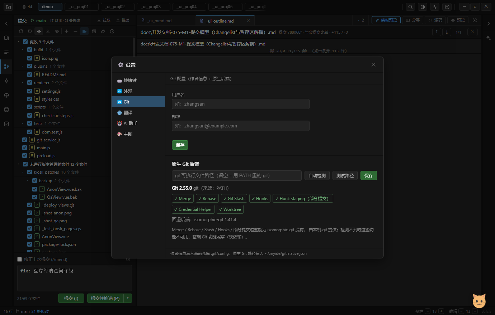

# 开发文档-076 · M2 原生 Git 后端与「按能力路由」+ IPC Registry

> 依据用户拍板：**native + isomorphic 混合，但叫「按能力路由」** ——
> 已稳定的 `status / log / diff / commit / branch` 继续走 isomorphic，不为架构漂亮重写；
> `merge / rebase / stash / hooks / apply --cached / credential` 走原生；
> 启动探测 `git path + version + capabilities`，没有本机 Git 就降级。
> 「M2 的 GitBackend 是在**收编现在已经存在的 spawn Git**，而不是推倒重建 Git 层。」
> 另外：**接受本机 Git 作为软依赖**（不是启动硬依赖）。

## 1. 分层：四个文件，各管一件事

```
git-ops.js       IPC 唯一清单（通道名 → 服务函数 / native 函数）      ← 唯一事实来源
   ↓ 按表注册
main.js          ipcMain.handle('git:*') → gitCall(op)（git worker） / nativeGit.fn()
   ↓
git-service.js   isomorphic-git 后端（status/log/diff/commit/branch/…，**没动**）
git-native.js    原生 git 后端（本机 git 探测 / 执行 / 凭证 / 代理）
```

`git-native.js` 是 M2 唯一的新后端；`git-service.js` 里的 38 个能力**一行逻辑都没改**，
只是把两处 `execFile('git', …)`（凭证、代理）的**实现**搬进了 `git-native.js`，调用点改成委托。

## 2. 能力探测

```js
const info = await git("backendInfo");
// { git: { available, exe, version, source, error, candidates },
//   caps: { merge, rebase, stash, hooks, partialStaging, credential, worktree },
//   fallback: { name: 'isomorphic-git', version: '1.41.4' },
//   routing: { native: [...], isomorphic: [...], planned: {...} },
//   ops: [41 个通道名] }
```

| 项 | 做法 |
|---|---|
| 候选顺序 | 用户配置的路径 → `PATH` 里的 `git` → Windows 常见安装位置（`Program Files\Git\bin\git.exe` 等） |
| 版本 | 跑 `git --version`，正则取 `major.minor.patch` |
| caps | 按版本门限推导（`partialStaging` 2.0+、`credential` 1.7+、`worktree` 2.5+，其余 1.0+）；**探测不到 → 全 false** |
| 缓存 | `probe()` 默认 60 秒缓存；设置页「测试 / 保存」强制重探 |
| 失败 | `run()` **永不抛**，统一返回 `{ ok, code, stdout, stderr, error }`；探测失败只是 `available: false` |

**软依赖的降级行为**：没有本机 Git 时，基础 Git 功能（isomorphic-git）照常；
设置页显示「未检测到本机 Git」+ 高级能力清单全 ✕ + 已尝试的位置；`caps` 全 false 让 M3/M4 的功能自己隐藏。

本机实测：`git 2.55.0`（来源 PATH），caps 7 项全 true，代理读到 `http://127.0.0.1:10808`。

## 3. 配置放在哪：`~/.myide/git-native.json`

**不用 `app.getPath('userData')`**：git 操作跑在 **worker 线程**里，它不经过 main 的初始化 ——
注入路径必然有一边拿不到（而且 worker 里读不到 main 的内存）。用固定的用户级路径，
主进程 / worker / 测试三方天然一致；`setConfigPath()` 只给测试改写到临时目录。
语义上也对：**"本机 git 在哪"对所有项目都一样**，不是某个 profile 的属性。

## 4. 设置页（Git 分类）



```
原生 Git 后端
[ git 可执行文件路径（留空 = 用 PATH 里的 git） ] [自动检测] [测试路径] [保存]
Git 2.55.0   git（来源：PATH）
✓ Merge  ✓ Rebase  ✓ Git Stash  ✓ Hooks  ✓ Hunk staging（部分提交）  ✓ Credential Helper  ✓ Worktree
回退后端：isomorphic-git 1.41.4
```

| 按钮 | 语义 | 落盘吗 |
|---|---|---|
| 自动检测 | 拿空路径试跑（走完整候选链），成功就刷新状态区 | ❌ |
| 测试路径 | 只试跑输入框里的路径，把结果写进状态区 | ❌ |
| 保存 | 写 `~/.myide/git-native.json` + 立即重探 | ✅ |

⚠ 自检只点前两个 —— **绝不在自检里写用户的 git 配置**。

## 5. 收编的两处 spawn（行为零变化）

| 能力 | 原来 | 现在 |
|---|---|---|
| 系统凭证 | `git-service.js` 里直接 `execFile('git', ['credential','fill'])` | `git-native.js credentialFill()`，`git-service` 委托调用 |
| 代理查询 | `git-service.js` 里 `git config --get-urlmatch http.proxy` | `git-native.js proxyFor()`，同上 |

两条**保留原有的所有坑规避**（照搬，不是重写）：`GCM_INTERACTIVE=never` + `GIT_TERMINAL_PROMPT=0`
（绝不弹窗阻塞 UI）、仅 http(s)、按 host 缓存、**失败不写缓存**（一次抖动固化 null 会让后续推送全跳过系统凭证）、
代理失败不缓存（否则整个会话直连）。

## 6. IPC Registry：一处清单，两处受益

`git-ops.js` 是**唯一清单**，`main.js` 按表注册 handler（参数原样透传，38 个逐条 handler 收敛成 6 行循环）：

```js
for (const spec of GIT_OPS) {
  if (spec.native) ipcMain.handle('git:' + spec.ch, (_e, ...args) => nativeGit[spec.native](...args));
  else            ipcMain.handle('git:' + spec.ch, (_e, ...args) => gitCall(spec.op, ...args));
}
```

**为什么 preload 与 dom mock 不一起自动生成**：`BrowserWindow` 是 `sandbox: true`，
**沙箱 preload 不能 `require` 本地模块**（只放行 `electron` / 几个内置模块），
而为了"少抄一遍接口"把 sandbox 关掉是拿安全换方便 —— 不划算。

改成**漂移检查**：`backendInfo` 返回 `ops`（清单里的通道名），
- 自检 `gitBackend` 步骤：`window.myIDE.git` 是否覆盖清单里每个通道（真实 preload 生效）；
- dom 测试：`require('../git-ops')` 与 mock 对表。
**结论：少加一处不再靠"记得"，而是 `npm test` / `--check-ui` 直接报出来。**

这条检查上线第一次就把一个**早就存在的缺口**抓出来了：dom mock 里 **缺 `cherryPick`**（之前没人用过所以没暴露）。

**白名单原则**（用户明确要求）：**没有 `git.exec(任意字符串)`**。渲染层只能调明确能力
（`backendInfo` / `setGitExe` / 将来的 `branch.merge` / `stash.create`），原生后端内部的 `run(args)` 不出口。

## 7. 验证

- `tests/git.test.js` **47 通过**（收编凭证/代理后行为不变）
- `tests/dom.test.js` **243 通过**（+1：清单与 mock 的漂移检查；设置页 Git 分类补了原生后端断言）
- `electron . --check-ui` **— 通过 / 0 失败**（38 → 40 步：新增 `gitBackend` + 收尾）
  - `backendInfo` 形状 / caps 7 项布尔 / **软依赖双向断言**（可用→版本形如 x.y.z；不可用→exe 空 + caps 全 false）
  - 设置页能力胶囊数量与 caps **on 的数量一致**、状态区与探测结果一致、输入框初值 = 手动配置的路径
  - 「测试路径」只读试跑不落盘、**清单 vs preload 漂移检查**

## 8. 与本机实测记录

| 项 | 值 |
|---|---|
| 本机 git | `2.55.0`（PATH） |
| caps | 7/7 可用 |
| 代理读取 | `http://127.0.0.1:10808`（与 gitconfig 里的 GitHub 代理一致） |
| 坏路径测试 | `C:/nope/nope.exe` → `spawn … ENOENT`，不抛异常 |

## 9. 下一步（M3）

hunk/行级部分提交：`git apply --cached`（`caps.partialStaging` 门控）+ Changes/Staged 真正双区 + Stage/Unstage Hunk。
M2 已经把能力探测、开关、路由表铺好了，M3 只要往 `ROUTING_DOC.planned` 里那几项填实现。
