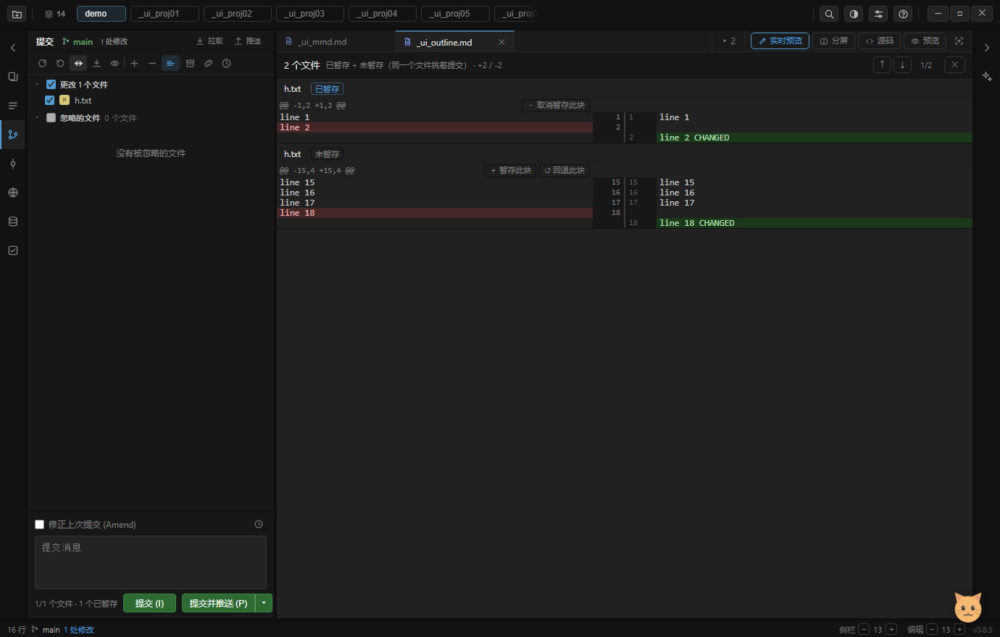

# 077 · M3：hunk 级部分提交（双区差异 + 块级暂存）

> 里程碑定义见 `074`（路线图）；M1 见 `075`，M2 见 `076`。本篇只写 M3 这一层。
> 结论先放：**「一个文件里两个功能改动拆开提交」现在能做了** —— 差异视图里每块 `@@` 有自己的按钮。



上图是自检实拍（`check-ui-1s-m3-hunk.png`，夹具仓库 `demo/_ui_hunkrepo`）：
同一个文件 `h.txt` 两块改动，**上面那块的 `line 2` 已进暂存区（HEAD→index），下面那块的 `line 18` 还在工作区（index→工作区）**，
两块各挂各的按钮：已暂存侧给「取消暂存此块」，未暂存侧给「暂存此块 / 回退此块」。

---

## 1. 双区语义：`git status` 的两栏，是两个方向的差异

之前只有一个 `diffWorkdir`（HEAD ↔ 工作区），把暂存区当不存在。M3 把它拆成两个方向 **各自成立** 的差异：

| 区 | 差异方向 | 通道 | 挂的按钮 |
|---|---|---|---|
| 更改（未暂存） | **index → 工作区** | `diffUnstaged` | ＋ 暂存此块 / ↺ 回退此块 |
| 已暂存 | **HEAD → index** | `diffStaged` | － 取消暂存此块 |

判定依据是 `statusMatrix` 的三个数字（`075` 里那张表）：`status` 以 `*` 开头 = 有暂存内容。
于是三种情形在 UI 上各有对应：

- `modified`（h===s）：只有未暂存 → 只画 unstaged 那一侧；
- `inIndexOnly`（stage=2，整份已暂存）：只画 staged 那一侧；
- `*modified`（stage=3，**暂存 + 未暂存**）：**两侧并排**，文件标题旁标「已暂存 / 未暂存」。
  这就是"同一个文件挑着提交"的入口 —— 也是 M1 特意留的那个口子的补法（M1 说"整份已暂存的文件不能从 IDE 提交，留到 M3"）。

⚠ 并排时两侧的 `r.file` 是同一个名字，所以侧标记**必须由结果自带**（`diffStaged`/`diffUnstaged` 返回 `side`），
不能靠"按文件名反查状态"——那样两块会拿到同一个侧，按钮就全错了。

---

## 2. 块级暂存：`updateIndex` 写回 index，不碰工作区

三个操作共用一套「取文本 → 把某一块应用上去 → 写 blob → 写回 index」：

```text
stageHunk(file, i)    读 index 文本 → 套上第 i 块（正向）→ writeBlob → updateIndex
unstageHunk(file, i)  读 index 文本 → 反向撤掉第 i 块     → writeBlob → updateIndex
revertHunk(file, i)   读 工作区 文本 → 反向撤掉第 i 块     → 直接写文件（index 不动）
```

关键点（三条都是踩出来的）：

1. **`updateIndex({ oid, mode })` 按 oid 覆盖** —— 不需要 `git add -p`、不需要 `apply --cached`，
   直接把合成好的内容写成 blob 再指向它即可。**但它要求 `oid` 是 40 位十六进制，
   传短哈希会静默写不进去**（第一版用了 `.slice(0, 10)` 显示用的短 oid，`statusMatrix` 毫无变化）。
2. **写回 index 的 mode 要沿用原条目的 mode**（`readIndexEntries` 里取的），否则可执行位会丢。
3. **`applyHunkToText` 带前置校验**：目标位置的现有内容必须与 hunk 对应侧逐行相符，不符就返回 `{ok:false}` 让上层提示刷新。
   这是"自研拼接"能站住的关键 —— **我们不猜**（比 `git apply` 的模糊匹配更保守），改不动就报错，绝不错位改。

行尾：比对时统一剥掉行尾 `\r`，写回时按**原文的 EOL 约定**拼（`detectEol`），
所以 autocrlf 仓库的文件不会被改行尾。`splitEol('')` 返回 0 行（不能变成 `['']`，否则空文件会多出一行）。

---

## 3. 一处顺带修掉的真 bug（自检截图抓到的）

M3 的自检要在夹具仓库里点开差异，于是把 `GitPanel.rootDir` 切到夹具仓库。截图里出现了不对劲的一行：

```text
忽略的文件 48 个文件      ← 夹具仓库里除了 h.txt 什么都没有
```

根因：`ignoredFiles` / `ignoredAll` 是**整个会话缓存**的，`rootDir` 的 setter **没有作废它**。
也就是说 **用户切换项目时，新项目会显示上一个项目的忽略清单**（切回再展开才可能对）。
修法：setter 里加 `invalidateIgnored()`，并补一条 dom 用例（反证过：去掉修复后该用例失败 `3 → 3`）。

---

## 4. 验证

- `tests/git.test.js` **49 通过**（新增「`applyHunkToText` 前置校验 + CRLF 保真」「暂存 → 回退 → 取消暂存（真实仓库，双区差异各自成立）」）
- `tests/dom.test.js` **245 通过**（新增「M3 双区：同一个文件既有暂存又有未暂存 → 两块并排各挂各的按钮」「切项目：忽略文件缓存跟着作废」）
- `electron . --check-ui` **369 通过 / 0 失败**（40 → 42 步）。M3 那两步是**真实仓库 + 真实点击**：

  | 断言 | 期望 |
  |---|---|
  | 未暂存差异切成 2 个 hunk | `hunks=2 :: line 2 / line 18` |
  | `stageHunk(0)` 后已暂存区 | 只剩 `line 2 CHANGED`（1 块） |
  | 未暂存区 | 只剩 `line 18 CHANGED`（1 块） |
  | `status` | `*modified` 且 `inIndexOnly=false`（部分暂存） |
  | `unstageHunk(0)` 后 | 回到 `modified`，工作区没被动 |
  | 点行 → 差异视图 | 2 个 `@@` 行，每块 2 个按钮 |
  | 点「暂存此块」 | index 真的只进这一块；两块并排 + 侧标记正确 |

  ⚠ 自检**绝不在 demo 本体上动 index**（demo 的仓库根就是 my_ide 自己）→ 用独立小仓库 `demo/_ui_hunkrepo`
  （`scripts/ui-fixtures.js` 的 `writeHunkFixture`，被 `.gitignore` 的 `demo/` 覆盖；跑完 `mv` 进回收站，
  不用 `fs.rmSync` —— 本机 safe-delete 接管递归删除）。

---

## 5. 已知限制 / 下一步

- **只到 hunk，不到行**（路线图里 M3 写的是「hunk / line」）。行级要再做一层「hunk 内挑行」的 UI，留到后面。
- **并排视图不合并**：同一个文件的两侧是上下两块独立 diff，不是 PyCharm 那种统一的"一个文件一个 diff + 两侧标记"。
  够用（能分别操作），但不紧凑。
- **不做三方合并**：`*modified` 的两侧各自对着自己的基线（HEAD / index）算，不存在合并冲突的概念。
- **`applyHunkToText` 是自研的**，没有走 `git apply`。好处是不依赖本机 git、可单测；坏处是模糊匹配能力弱于 git
  （挪了行的 hunk 会拒绝而不是尽力应用）。真出问题时用户可以刷新差异重试。
- **`caps.partialStaging` 目前没被这段逻辑用到**（自研实现不依赖本机 git），能力位留给"以后要换 `git apply --cached`"时门控。

下一步按 `074` 是 **M4：分支工作流 + 冲突解决器**（merge / rebase / 操作状态机 / continue·skip·abort）。
