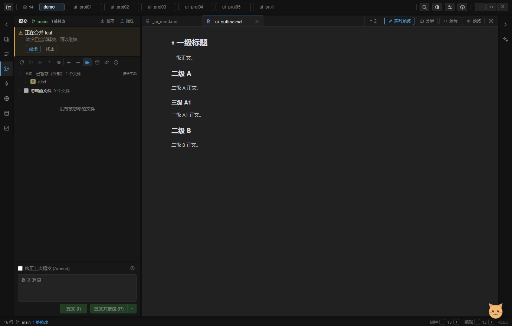

# 078 · M4：分支工作流与冲突解决（merge / rebase / 操作状态机）

> 路线图见 `074`；M1=`075`、M2=`076`、M3=`077`。本篇是 M4。
> 结论先放：**merge / rebase 现在能在 IDE 里做了，出冲突不再是一句 toast 把用户推给命令行** ——
> 面板顶部出现「操作进行中」条，冲突走三方对比窗口，选完一侧点「继续」收尾。



上图是自检实拍（夹具仓库 `demo/_ui_confrepo`，两个分支改了同一行 → merge 必然冲突）：
操作条显示 `正在合并 feat · 1 个冲突待解决`，冲突窗口里是 `base / 当前分支 / 传入的改动` 三方内容。

---

## 1. 为什么这一步必须走原生 git

isomorphic-git **没有 merge / rebase**。自己实现等于把三方合并算法重写一遍 —— 这正是 M2 定下
「按能力路由」要避免的路。所以 M4 的 12 个新通道全部走 `git-native.js`（本机 git 2.55+）：

| 通道 | 命令 | 说明 |
|---|---|---|
| `opState` | 读 `.git` 标记文件 | 状态机（见下） |
| `merge` / `rebase` | `git merge` / `git rebase` | 冲突**不算失败**（见 §2） |
| `conflicts` | `git diff --name-only --diff-filter=U` | 未合并条目 + 是否已 add |
| `conflictSides` | `git show :1/:2/:3:<file>` | 三方内容（base / ours / theirs） |
| `resolveFile` | `git checkout --ours/--theirs` + `git add` | 选一侧并标记已解决 |
| `continueOp` / `skipOp` / `abortOp` | `--continue` / `--skip` / `--abort` | 按当前状态选命令，用户不用知道细节 |
| `branchCreate` / `branchRename` / `branchDelete` | `git branch` | isomorphic 的 branch 只能从 HEAD 建、不能删/改名 |

无本机 git（软依赖）时：分支菜单**不给**这几项（`caps.merge` 判定），冲突窗口进不去 —— 不是点了报错。

## 2. 操作状态机：冲突是「进行中」，不是「失败」

```text
NORMAL ──merge──→ MERGING ──继续──→ NORMAL
        ──rebase──→ REBASING（step/total）──继续/跳过──→ NORMAL
        ──cherry-pick/revert──→ CHERRY_PICKING / REVERTING ──继续/跳过──→ NORMAL
                        任意状态 ──终止──→ NORMAL（回到操作之前）
```

**最容易做错的判断**：merge / rebase 撞冲突时 git 退出码非 0。把它当失败（toast 一句报错了事）
就是现在大多数轻量 Git 客户端的样子。正确语义是「**命令成功地把仓库带进了待解决状态**」：
`ok: true, conflict: true`，并顺手读出状态与进度。

状态判定与 git 自己判断 "You have not concluded your merge" 同源 —— 读 `.git` 下的标记文件：
`MERGE_HEAD` / `rebase-merge`·`rebase-apply`（顺带读出 `head-name`、`onto`、`msgnum`/`end` 做进度）/
`CHERRY_PICK_HEAD` / `REVERT_HEAD`。`continueOp`/`skipOp`/`abortOp` 按状态选命令；
**没有进行中的操作时明确拒绝**（"当前没有进行中的 Git 操作"），`skipOp` 对 MERGING/REVERTING 也明确拒绝
（merge、revert 无处可跳）—— 比按钮点了没反应好。

## 3. ours / theirs 在 rebase 时是**反的**（这是本次最危险的一处）

git 的 `--ours` / `--theirs` 是**流语义**，不是"你的 / 别人的"：

| 操作 | ours | theirs |
|---|---|---|
| merge | 当前分支（HEAD） | 被合并进来的 |
| rebase | **新基底**（rebase 目标） | **正在重放的提交（= 你的改动）** |

实测（`tests/git.test.js`）：`main` 上 `rebase feat`，三方内容是 `base=共同祖先 / ours=feat / theirs=main`。
如果 UI 一律写"ours=你的修改"，用户在 rebase 冲突里就会选反 —— 而且选错不报错，只是悄悄丢了改动。

对策：文案由 `opState` 决定，rebase 时显示「新基底（x 侧）」与「正在重放的提交（你的改动）」。
dom 测试里有专门一条断言守着这两组文案。

## 4. UI：操作条 + 冲突窗口

- **操作条**（提交面板最顶部，比工具行更靠前 —— 它是当前最该处理的事）：
  `⚠ 正在合并 feat` / `正在变基：把 main 重放到 feat（第 1/2 步）` + `N 个冲突待解决`，
  按钮：`解决冲突` / `继续`（有未解决冲突时**禁用**，不让用户点了撞墙）/ `跳过`（仅 rebase·cherry-pick 显示）/ `终止`（有确认）。
  样式用警告色左线 + 7% tint，不整块高亮 —— 强调色预算里它不该比"当前文件"还抢。
- **冲突窗口**：左列冲突文件（✓ 已解决 / ⚠ 待解决），右侧三方对比（base / ours / theirs 三列并排），
  每列一个「用这一份」→ `resolveFile` → 标记已解决 → 面板刷新 → 窗口重开（展示新状态）。
- 分支弹窗（M4-C）：每个分支行 hover 出现 `⋯` →
  `检出` / `从「x」新建分支…`（以它为起点，不必先切过去）/ `合并「x」到当前分支` / `把当前分支变基到「x」` /
  `重命名为…` / `删除「x」`（先 `-d`，被 git 拒绝后再**问一次**是否强删，不悄悄替用户做决定）。
  当前分支不给合并/变基/删除。

## 5. 验证

- `tests/git.test.js` **52 通过**（+3，真实仓库 + 本机 git；没装 git 时打 SKIP 不算失败）：
  - `NORMAL → merge 冲突 → MERGING → 解决 → continue → NORMAL`（含三方内容、resolved 标记、选 ours 后文件内容）
  - `rebase 冲突 → REBASING → abort → NORMAL`（含 step/total 进度、ours/theirs 反向、abort 后内容复原）
  - NORMAL 下 continue/skip/abort 都明确拒绝
- `tests/dom.test.js` **247 通过**（+2）：操作条/冲突窗口全链路（mock）+ 分支行 ⋯ 菜单
- `electron . --check-ui` **结果见提交信息**（42 → 44 步）。M4 两步在夹具仓库 `_ui_confrepo` 走**真实 native git**：
  merge → 操作条出现 → 冲突窗口 → 选 ours → 冲突清零 → 「继续」解禁 → 收尾步点继续完成合并
- ⚠ 自检坑（已记入 skill）：夹具清理**不能用 `fs.rmSync`** —— 本机 NODE_OPTIONS 注入的 safe-delete 垫片
  在 `npm run` 下会**挂住不返回**（直跑 node 却正常）。测试里的 `rmSync(tmp)` 同样改成 rename 进临时回收站。

## 6. 已知限制 / 下一步

- 冲突窗口是**只读三方对比 + 选一侧**，还不是 PyCharm 那种三栏可编辑合并器（逐行点选 / 手工拼）。
  手工合并的出口：在编辑区打开文件改完 → 文件行勾选提交（走 M3 双区）。
- 没做 `git pull` 的策略选择（merge / rebase / ff-only）—— 现在的 pull 仍是 fetch + fast-forward（`074` P1 项）。
- `cherry-pick` / `revert` 的冲突已进状态机（`CHERRY_PICKING` / `REVERTING`），但这两处本身的实现还是
  isomorphic 手工重放，遇到复杂冲突时行为可能与 git 有差 —— 后续可整体切到 native。
- 远程分支（`origin/x`）还没进分支弹窗（M4-C 只做了本地分支）；upstream / compare 也还没做。
