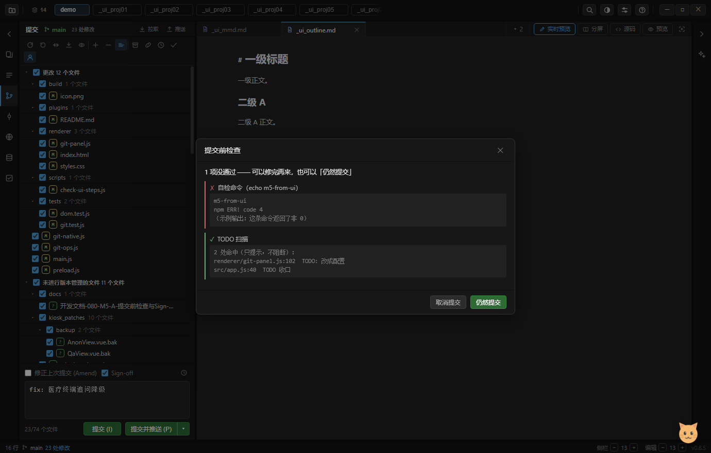

# 080 · M5-A：提交前检查（Before Commit）+ Sign-off / 作者覆盖

> 路线图见 `074` 的 M5；待办第 4 / 5 节是这两项的原始规格。本篇是 M5 的第一批。

上图是自检实拍：一条命令返回非 0（红）+ TODO 扫描命中（绿），底部是「取消提交 / 仍然提交」。
提交输入框上方那行只剩 `修正上次提交 (Amend)` 与 `Sign-off` —— 两个新入口在**工具行末尾**（见 §4 末尾说明）。

## 1. 做了什么 / 明确**不做**什么

PyCharm 的「提交前」有七项。按其真实可行性，这一批只做**能立刻防住问题**的四类：

| 做 | 说明 |
|---|---|
| 提交消息校验 | 必填（原有）+ 正则 + 主题长度上限 |
| Check TODO | 扫**这次要提交的文件**，列 `文件:行号`，**只提示不阻断** |
| Run Git hooks | 交给 git 自己跑（`git hook run pre-commit`），非 0 → 中断提交并显示输出 |
| 自定义命令 | 如 `npm run lint` / `pytest -q`，按顺序跑、前一条失败就停 |

| **不做**（并在 UI 里写明） | 理由 |
|---|---|
| Reformat code / Rearrange / Optimize imports / Analyze code | 需要把 JS/TS/Python/MD 四套 lint·format 工具链接进来 —— 那等于把 IDE 的 lint 层重做一遍，是另一个量级的工程。**明确不做，避免以后被"PyCharm 有"推着交半成品。** |

## 2. 一个执行器跑两类东西

`.git/hooks/pre-commit` 与"用户配置的命令"看起来是两件事，实际是同一套：**执行 → 捕获输出 → 判退出码 → 失败即停**。

区别只在"谁来执行"：

- 用户命令走 shell（`exec`）—— 需要 `&&`、管道、`npm` 这些；
- **钩子交给 git 自己跑**（`git hook run pre-commit`，git ≥ 2.36）。自己 spawn 要处理"Windows 下有没有 `sh`"、
  "文件没有可执行位要不要紧" 这类平台差异，而 git 已经全部处理好了。实测（本机 git 2.55）：
  钩子退出 1 → `git hook run` 返回码 1 且钩子输出走 **stderr**；没有钩子时报
  `cannot find a hook named pre-commit` —— 所以**先判文件存在**，不存在记为"跳过（正常）"而不是失败。

结论落成 `precommitRun(repo, { runHooks, commands })`：失败即停，返回
`[{name, ok, code, out, skipped}]` 供结果面板逐条展示。

## 3. 提交时只拦"阻断项"，提示项不打断

检查结果分两档，这是**避免"每次提交都点一次弹窗"**的关键：

- **problems（阻断）**：消息不合规、命令/钩子非 0 → 弹结果面板，必须显式点「仍然提交」才继续（PyCharm 也允许带警告提交）；
- **warnings（提示）**：TODO 命中、跳过项、通过项 → **不打断流程**，不弹窗。

结果面板里失败项给红色左线、通过/提示项给绿色左线，输出放 `<pre>`（失败时最有用的就是原样输出）。

## 4. Sign-off 与作者覆盖

- **Sign-off（DCO）**：勾选后提交时在消息**末尾追加** `Signed-off-by: 姓名 <邮箱>`。
  ⚠ 三个细节：① **不写进输入框**（否则草稿/历史里也会带上，第二次提交就重复了）；
  ② **已有同样一行就不再加**（幂等）；③ 签名跟着"本次提交的作者"走 —— 用了作者覆盖就写覆盖后的身份。
  勾选状态存 `myide-git-ui`（与视图偏好同键）。
- **作者覆盖**：`commit()` 早就接受 `author` 参数（一直没人用）。现在补上入口：
  作者按钮 → 弹窗（默认填 `getUserConfig` 的 name/email）→ 覆盖后按钮进入"已覆盖"态、tooltip 显示当前身份。
  ⚠ **只影响这一次提交，不写回 git config**；与默认值相同时自动取消覆盖；**切项目即失效**（它是"这一次"的临时状态）。
  实现上把作者写进**提交消息编辑器**（真正的作者会显示在提交里，不留痕）。

## 5. 配置存哪

`<项目根>/.myide/precommit.json`（与变更列表同思路：随项目走），写失败降级 `localStorage`;
读的时候先文件后 localStorage。切项目重载。

## 5.5 按钮位置：为什么挪进工具行

第一版把「提交前检查」「本次作者」放在提交输入框上面那行（Amend / Sign-off 旁边）。自检截图立刻暴露问题：
340px 侧栏里这一行挤了 4 个控件 + 3 个图标，**「修正上次提交 (Amend)」被压成省略号**。

按已记录的规矩（"标题行/工具行塞不下时的正解是移走次级按钮，不是压标题"）→ 两者挪进**工具行末尾**
（工具行 11 → 13 个图标）。它们本来就是仓库级操作，与刷新/回滚/差异同层。
⚠ 两个陷阱：① 工具行**每次 render 都重建**，handler 必须在 `buildToolbar` 里绑（不能像静态按钮那样 init 里绑一次）；
② 追加只能放**末尾** —— 有测试按索引取按钮（`[4]=预览`）。

## 6. 验证

- `tests/git.test.js` **56 通过**（+2，真实仓库）：
  - 没有钩子 → skipped 且不算失败；三条命令按序跑、第二条 `exit 7` → 停且退出码透传；
    真写一个 `pre-commit`（`exit 1`）→ 不通过 + 输出捕获 + 后续命令不跑；改成 `exit 0` → 通过
  - TODO 扫描：行号 / 关键字对得上、含 NUL 的二进制不扫、关键字可配
- `tests/dom.test.js` **253 通过**（+3）：结果面板取消/仍然提交两条路、Sign-off 幂等 + 作者只进这次提交、
  配置弹窗保存与消息正则阻断
- `electron . --check-ui`：44 → **46 步**，新增 M5 两步（真实执行器 + 配置弹窗 + 结果面板截图 `check-ui-1u-m5-precommit.png`）
- ⚠ 自检里**不跑真实 lint**（可能几十秒），用 `echo` / `exit 4` 证明"执行器真的通"；
  配置写在 `demo/.myide/`（被 gitignore），收尾步恢复默认；`myide-git-ui` 已加入全局还原键列表。

## 7. 下一步（M5 剩余）

Local History（AI checkpoint）→ Git Log 三栏（Branches Pane）→ 工具行收 `⋮ More` →
高级 Git（interactive rebase / reset / worktree / submodule / multi-root / signing）。
