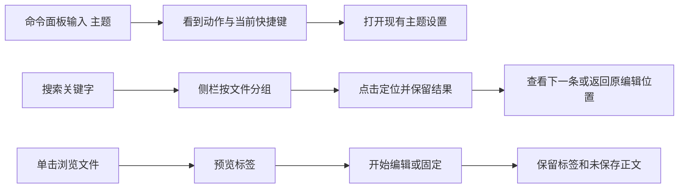

# UI、交互与新增功能改进方案

> 2026-10-01；审查基线 `634990d`。响应用户“有没有UI设计、交互和添加功能的改进”的方向补充。
> 本文是产品体验方案，未修改产品界面、快捷键或功能。关联089的UI-01、SEARCH-01、EDIT-01、PROJECT-01等既有条目；下文U/I/F编号仅用于本方案追踪，不另造一份模块状态来源。
> 后续细化：[105 命令面板与常驻搜索交互合同](./开发文档-105-命令面板与常驻搜索交互合同.md)提供左侧/底部结果样机对比、共享动作、搜索终态/归属、位置历史和三包产品验收；仍为设计交付。
> 标签专项：[106 标签身份与预览固定交互方案](./开发文档-106-标签身份与预览固定交互方案.md)复现后台关闭切换、排序身份分裂等6项受控观察及2项真实CM6对拍，细化身份/批量关闭、同名/键盘、预览固定、关闭重开四包；仍待产品实施。
> 启动体验：[108 启动状态与日志阅读交互方案](./开发文档-108-启动状态与日志阅读交互方案.md)补7项完整面板受控观察与2项正向对照，细化状态/操作反馈、日志阅读查找、错误定位/就绪、配置复用/运行记录四包；没有运行用户进程或新增产品功能。

## 1. 改进方向不能只剩性能

持续审查需要同时回答：界面看得明白吗、操作顺手吗、有没有值得增加的能力、数据与速度能否支撑它。100完成的是性能专项，不能代替前面三个问题。后续每轮总结都给出UI/交互/功能的结论与下一步；该模块无需新增功能时说明已有能力和取舍，而不是硬凑功能数量。

UI设计关注层级、位置、留白、密度、状态和可发现性；交互关注选中/焦点、鼠标/键盘一致、取消/返回、错误后继续工作；新功能必须说清具体省掉什么操作。性能与可靠性作为这些体验的验收条件，与功能价值一起排期。

本次建议最先交付的可见体验是：**快速打开键盘修复与统一焦点、命令面板、搜索结果可常驻、标签同名辨识与预览/固定**。失败可回看和恢复入口同步接入已落地保存合同；导航历史/专注模式随后。全项目替换、任意双文件分屏等更复杂能力另排，避免一轮重做整个工作台。

## 2. 已有能力与本轮证据

| 当前能力 | 当前代码/证据 | 本轮处理 |
|---|---|---|
| 深浅/自定义主题、字号、快捷键修改与冲突提示 | theme.js、settings.js、shortcuts.js | 改层级、对比度和发现路径，不能再列“新增主题/快捷键系统” |
| 快速打开、最近文件/项目、文件树定位与虚拟化 | quickopen.js、viewer.js、app.js、tree.js | 补键盘一致、排序、同名辨识，不重造最近文件入口 |
| Markdown实时/源码/预览/源码-预览分屏 | viewer.js的live/split/source/preview | “任意两个文件并排”才是新增候选，不能把现有Markdown分屏列成未实现 |
| 标签拖动排序、中键关闭、关闭其他/全部、文件历史 | viewer.js:renderTabs/ctxTabMenu | 预览槽/固定与关闭重开为新增候选；106核对当前没有关闭右侧菜单 |
| Ctrl+Tab顺序换标签、编辑器查找替换、Git双栏diff/块级操作/历史 | shortcuts.js、viewer.js、git-panel.js、git-log.js | 不把已有功能重新加入待办；MRU选择/项目替换/任意文件对比需单列 |
| 左侧工具切换、右侧AI独立、两侧栏可收起/调整宽度 | app.js工具状态、布局与shortcuts.js | 提议专注模式和低频入口收纳，不改变默认键位或原停靠关系 |
| 保存结果/版本保全第一包已实施 | 634990d、101；本轮后台DOM295/0 | 保留失败阻止离开和在途新输入；下一步是失败可回看、另存/冲突恢复，不再描述为仍无保存闸门 |
| 搜索弹窗、任务列表/依赖/布局/过滤、启动日志、数据库分页、AI上下文/权限/变更卡片、浏览器收藏 | 对应完整模块；091–099有专项取证 | 补可理解状态和工作流，已有能力不重复开发 |

源码核对：Shortcuts已有注册表 `{id,desc,keys,run}` 和 `bindings()`，没有命令面板执行入口；Viewer未见预览槽/标签固定/关闭重开合同；App已有单独收起左右栏，没有组合进入/退出专注的快照；quickopen与search均用Modal，搜索pick后关闭列表。未在本轮核查所有外部插件，不能据此宣称插件里绝无类似能力。

### 2.1 新增的受控交互观察 R

使用jsdom加载**原quickopen.js**，从原app.js完整提取Modal定义；App.root、fs.listAll、Viewer.recentFiles/openFile为受控桥。没有修改真实文件/用户设置，也没有模拟实际Electron焦点或读屏。

| 编号 | 操作/观察 | 意义 |
|---|---|---|
| Q1 | 空查询显示1份recent.md；↑↓/Enter后openFile调用0次；鼠标点击同条调用1次 | 最近行没有写入统一results模型，鼠标可用、键盘不可用；属于交互正确性，非速度问题 |
| Q2 | 500候选，前401份`n_e_e_d_l_e_<i>.txt`为较低分字符序列匹配，第450份`needle.txt`精确匹配；查needle显示30条但不含needle.txt | 先截断再排序使真正更好的结果不参与排名；需要全候选top-K或可靠索引，不能仅加UI“前30条”解释 |
| Q3 | 原Modal移除含焦点输入的quickopen后document.activeElement为BODY，未回到原trigger；通用show/hide无焦点栈/角色设置 | jsdom仅支持DOM焦点归属观察。源码C另确认未由通用Modal保证dialog/inert/focus-trap，实际系统焦点/键盘Tab/读屏仍待验 |
| C1 | 普通非空查询Enter打开选中结果，鼠标最近条可打开 | 保留正向能力，不以Q1/Q2推断整个快速打开不可用 |

这些观察纳入I1；091的搜索选中/跳行/旧结果、099的大纲焦点/标题定位等继续复用，不再用全部“待调研”掩盖已有R。101记录的四项通用UI失败属于此前基线对拍结果，本轮未复跑截图，不能当本轮新增UI缺陷或宣布已修复。

## 3. 成熟项目参考与借鉴范围

| 参考（2026-10-01核对官方来源） | 借鉴到MyIDE |
|---|---|
| [VS Code工作界面](https://code.visualstudio.com/docs/editing/getting-started/userinterface)的命令面板、预览标签、固定标签、路径导航 | 用统一命令找现有动作，减少记键位/翻菜单；预览浏览文件、编辑后保留；同名标签补路径 |
| [VS Code搜索与替换](https://code.visualstudio.com/docs/editing/codebasics#_search-across-files) | 按文件分组的结果、单击定位、范围/排除、变更预览；先做搜索工作流，再做受保护的项目替换 |
| [VS Code布局](https://code.visualstudio.com/docs/configure/custom-layout) | 可收起辅助区域与专注阅读；复原进入前布局，不强迫全屏 |
| [IntelliJ Search Everywhere](https://www.jetbrains.com/help/idea/searching-everywhere.html) | 文件/动作/设置有统一可搜入口和当前快捷键；首批只接现有动作，不扩到语言符号索引 |
| [IntelliJ编辑位置导航](https://www.jetbrains.com/help/idea/navigating-through-the-source-code.html) | 返回/前进恢复文件与位置，解决搜索跳转后找不回刚才那行 |
| [IntelliJ Local History](https://www.jetbrains.com/help/idea/local-history.html) | 时间线+差异+显式恢复，补未提交内容找回；借思路，不宣称本地历史等于备份 |
| [Obsidian Backlinks官方帮助源码](https://github.com/obsidianmd/obsidian-help/blob/master/en/Plugins/Backlinks.md) | Markdown反向链接与引用来源，作为可停用的插件候选，补已有wiki链接的反查 |
| [WAI-ARIA Dialog](https://www.w3.org/WAI/ARIA/apg/patterns/dialog-modal/)、[Combobox](https://www.w3.org/WAI/ARIA/apg/patterns/combobox/) | 焦点进入/范围/返回、弹窗栈、命名、键盘选择和选中播报；不是贴aria属性就算读屏完成 |

不复制成熟IDE的全部界面或语言服务。大纲明确排除完整LSP、远程开发、账号体系；本轮不扩这几项。现有数据库/浏览器等历史例外保留使用，UI改进不是新建部署/多用户系统的授权。

## 4. UI设计：看得懂、找得到、状态有层级

### U1 工作台层级与入口（UI-01，P1）

**场景**：工作台工具多，用户要知道正在操作哪个项目、哪个文件，以及哪里切换工具。现有工具状态与右栏独立已实现；拥挤/截断程度需要新截图测量，不能先写成普遍视觉故障。

**设计**：项目切换保持顶部；文件标签/当前文件操作留在编辑区；工具带只承载工具导航；状态栏只显示当前文档/分支/持久失败。高频入口（项目、大纲、提交、搜索）优先，低频工具进入可定制“更多”，默认保留现有可见集合并允许恢复。不要按猜测把用户正在用的数据库/启动工具隐藏。

**视觉合同**：标题、正文、路径/辅助文字三层，活动工具/活动文件唯一强调；hover、selected、keyboard focus三个状态明确，未保存/失败/加载中用文字或形状而非只换色。沿现有theme token，不额外引入一套配色。列表/工具条/设置分类逐步统一线性SVG；右键emoji惯例保留。文字与icon共用可访问名称，不靠长tooltip承担必需信息。

**验收**：深/浅主题，1280与1920窗口宽度、260/340/480侧栏、100/125/150%缩放，长中文项目名/文件名仍能辨识。低频功能可由更多/命令面板找到，重置能回原布局。视觉修改必须真实headless截图看图；现阶段本文没有截图达标证明。

### U2 标签与路径辨识（EDIT-01/PROJECT-01，P1）

**设计**：同名文件按最短可区分父路径显示，如`src/index.js`与`tests/index.js`；普通唯一文件仍简名。当前标签可见、固定与预览有文字/图形区分、dirty提示单独保留。大量标签用“已打开文件”列表，不强行堆多行挤正文。路径导航复用现有状态栏/标签操作区，先提供复制相对路径与在文件树定位；面包屑是否常驻由窄屏样机决定。

**验收**：两个同名、长中文、路径重命名、20标签、dirty与固定叠加；中段省略仍保编号/扩展名，完整路径键盘可查看。此项可先交付同名辨识，不必等待F2预览标签或双编辑组。

### U3 状态与恢复入口（EDIT-01/SETTINGS-01/TASK-01，P1；数据保全仍P0）

**设计**：成功短提示即可；保存/迁移/连接失败同时留下可回看的状态记录。建议状态栏“2项需要处理”打开紧凑列表，每项显示对象、失败原因、时间、已确认的恢复来源和可用动作。文档保存失败显示“仍有未保存修改：重试 / 另存为”；未实现另存前只提供真正可执行的重试，不放假按钮。自动保存失败去重，成功后收敛；无须为每次成功重复通知。

**边界**：承接101保存结果，不自行把失败清dirty。只在实际版本保存成功后移除条目；任务降级副本/设置镜像与项目文件明确区分。恢复卡片不显示密钥，历史操作不是“撤销任何操作”的承诺。

**验收**：toast消失后仍找得到失败对象；同文件连续失败合并、另一文件独立；重试期间输入保留，成功但还有新修改时状态准确。磁盘冲突比较/恢复依赖FS-01真实版本合同。

## 5. 交互改进：少重复操作，操作结果一致

### I1 快速打开、弹窗与焦点（UI-01/SEARCH-01/OUTLINE-01，P1）

统一结果模型供鼠标、方向键、Enter使用，最近文件也进入结果集合；top-K从全候选评分而非前401项截断。查询载入/切项目的迟到结果受generation约束。输入法组合期间不触发提交；没有结果时Enter不打开旧条目。

Modal记录每层invoker和焦点，栈顶接管Tab/Shift+Tab/Esc，关闭恢复到原控件或合理的编辑位置；背景不可操作，避免浏览器原生视图盖住弹窗，复用096的overlay生命周期。破坏性确认默认安全动作，按钮写“删除3个文件”而非抽象“确定”。设置/大纲方向键只在相应控件焦点范围内生效。选中状态与键盘焦点分开。

**验收**：Q1/Q2/C1、嵌套设置→确认→返回、取消后继续输入、IME Enter、搜索↑↓/Enter、其他输入框不被抢键；DOM和真实Electron键盘分别记录。隐藏窗口不能取得的系统焦点场景留待可交互验证，不能把SKIP算通过。

### I2 搜索结果持续工作流（SEARCH-01，P1，新增呈现能力）

保留Ctrl+Shift+F入口，结果可选择留在侧栏；常驻列表与快速弹窗共享查询/结果模型，不各自跑一套搜索。按文件分组，文件名+命中数为组头，行号+匹配片段为子项；点击/Enter把编辑器定位到准确匹配并短暂高亮。点击结果后列表仍在，能连续看下一条；取消恢复查询前焦点。保留现有快速弹窗作为可选轻量入口。

顶部显示查询、范围、大小写开关；排除规则收进展开区域。loading/no-results/result-limit/timeout/error/cancelled各自文案，不把“没有匹配”用在未扫完/编码略过。隐藏文件/忽略/编码政策见091/100，不先用UI开关假装后端已支持。全项目替换属于F6，不能在列表里顺手加无保护“全部替换”。

**验收**：一组多行、跨文件、查询A/B乱序、清空、切项目、只读文件、已达200、超时、有略过；点击第N条与键盘第N条同一位置。新布局减少重复打开查询，不改变底层命中语义。

### I3 选中与作用域一致（TREE-01/TASK-01/GIT-01，P1）

文件树当前文件与批量选择分开；右键对象明确是当前条目还是所选集合；拖动前显示目标目录和冲突策略，失败保留选择与来源。危险动作旁列出对象数量/完整可区分路径；undo只有存在恢复来源且当前版本匹配才展示为可执行。

任务过滤后“没有任务”与“没有符合过滤条件”区别，提供清空过滤；列表选中与图定位共享taskId。Git提交窗口区分工作区/暂存区/本次勾选，按钮语义对应实际提交集合；旧diff失效后显示“文件已变化，刷新差异”，不静默换块。保留既有提交消息、选择、依赖布局与撤销。

**验收**：混合多选、右键未选项、拖动冲突取消、任务过滤/折叠、Git外部更改；UI标识的对象与实际操作一致。数据层问题仍按097/094修，不能只改确认框就宣布保全完成。

## 6. 新增功能候选：明确最小版本与依赖

| ID/建议顺序 | 能力与“省掉什么” | 最小版本/入口 | 依赖、验收与取舍 |
|---|---|---|---|
| F1，P1优先 | **命令面板**：少记快捷键、少翻菜单 | 候选Ctrl+Shift+P（核对冲突后），中文名称/别名搜索现有动作，显示自定义后的快捷键；无项目也可打开设置/项目 | 扩展Shortcuts动作描述的enabled/context/run，菜单/键位/面板调用同一动作。不能复制run或给按钮绑另一套行为；不可用项解释原因，危险命令仍走原确认。输入“主题”“提交”“文件历史”能发现；快捷键改后立即一致 |
| F2，P1 | **预览标签+固定标签**：浏览很多文件不用关一长排；常用文件不易挤走 | 预览模式可选，默认先保持旧开文件习惯；单击预览、双击/编辑转保留；固定由右键/命令进入 | dirty/在途保存/未恢复草稿永不被预览替换；固定不等于只读，批量关闭默认跳过固定并明示。稳定tabId与101串行/关闭合同；A→B浏览、编辑A、错误读取B、重命名、重启均验 |
| F3，P1 | **返回/前进和最近编辑位置**：搜索/链接跳走后不用重新找原行 | 记录文件身份、revision锚点、光标与滚动；项目内导航栈，上限建议100条，连续同处合并 | 不是最近文件名单或Ctrl+Tab顺序循环。重命名映射，删除提示或跳过；文本变化用可映射锚点/回落行，不能盲信旧offset。返回后新跳转裁剪前进分支；切项目隔离 |
| F4，P1 | **专注模式**：一次收起辅助区域，阅读/写作完一键回来 | 入口放布局/命令；保存左右栏/工具/宽度快照，仅改变显示，不默认全屏 | 保留必要dirty/错误入口，关闭辅助UI不停止用户启动的服务、不丢AI上下文。退出恢复进入前布局，途中明确调整有确定覆盖规则；不照搬VS Code组合键，现Ctrl+K是提交 |
| F5，P1分阶段 | **另存为+草稿/本地历史恢复**：失败时能带走输入，误改/崩溃后能找回未提交内容 | 第一包另存当前内存版本，成功后才关联新路径；第二包草稿恢复列表/差异；最后可选版本时间线 | 依赖FS-01格式/原子/版本和095草稿。另存失败留原dirty和路径，遇已有文件明确覆盖；dirty在途新输入不丢。历史按保留天数/总字节限额、可删除，不等于Git历史或正式备份；二进制/大文件先标能力 |
| F6，P2后续 | **全项目替换预览**：多文件重复修改不用逐文件Ctrl+H | I2范围内先做字面匹配；列文件/命中/差异、勾选应用，显示成功/冲突/失败 | 依赖FS-01版本与恢复来源，dirty文件协调；确认后文件变化拒绝并重新预览，多文件非原子必须准确报告部分成功。不能以默认200条结果直接做“全项目全部替换”；正则第二包另定语义 |
| F7，P2 | **任意两文件比较，随后评估双文件编辑**：不用临时建Git提交或来回切标签 | 第一包文件树“选择用于比较/与所选比较”，只读diff；第二包至多两编辑组、可关回单组 | 现有Git双栏和Markdown源码-预览已实现。diff可复用算法，任意文件编码/二进制/大小/外部版本仍要定义；双组共享文档与dirty，不能两份缓冲互相覆盖。用户常用后再扩任意网格 |
| F8，P2插件候选 | **Markdown反向链接/文档收藏位置**：找“哪些文档引用了这里”，固定常看章节 | 大纲/文档菜单入口，链接来源列表定位行；收藏按文档身份+标题锚点存储 | 复用099正确标题索引与wiki解析；本轮未审查外部插件提供情况。正文/代码围栏/同名/重命名/不存在目标分别处理；项目边界、取消和索引更新明确。功能名用“文档收藏”，与浏览器“收藏”对象区分，不另造“书签/收藏夹”体系 |

### 6.1 三个优先工作流

这是提议流程，不是当前产品截图。建议先做可评审样机，验证命令可发现、结果可连续查看、预览不会丢输入，再实现数据/状态接入；不能拿静态样机当功能完成。

## 7. 其他已存在模块的体验包

| 模块 | UI/交互建议 | 可新增的最小能力及边界 |
|---|---|---|
| 设置 | 分类与选项统一术语，全文搜选项、修改来源/生效范围/重置可见；密钥仅显示已配置 | 设置搜索接F1或同一schema，不能只搜索快捷键描述；项目级覆盖尚需持久化合同，不先做假“工作区”切换 |
| AI | 上下文条明确跟随/固定/临时引用；工具卡显示待确认→执行→完成/失败/取消→已撤销，跨项目不串卡；已过期diff有刷新动作 | 变更审阅汇总/按文件筛选，逐项应用与恢复依赖098；停止后必须准确显示已执行/未执行，不能一律“已撤销” |
| 启动面板 | 启动中/运行/停止中/失败有统一样式，退出码/错误保留，按钮按状态可用；日志搜索/暂停滚动/复制清晰 | 可选就绪规则（端口/指定输出）和日志内容搜索先核对实际入口；092所有权合同先保证停止对象正确，不把UI绿点当服务就绪 |
| 数据库 | 连接、数据库/表、当前查询上下文可见；结果/消息分清，旧请求不覆盖新结果，空结果保留列；事务状态依真实能力呈现 | 历史/选中执行/补全/EXPLAIN/整表导出已有；新增候选为查询收藏、SQL文件复用、结果固定与已获取结果导出。109细化四包；编辑结果或提交/回滚按钮需092真实事务支持 |
| 任务 | 清单与图共享选中，过滤有清除、状态变更反馈、删除可恢复性可知；依赖冲突解释具体链 | 任务附文件/行/章节引用候选，点击回编辑器、重命名跟随；当前描述/依赖/过滤/多布局已有。引用不加入复杂团队协作或账号系统 |
| 浏览器 | 统一地址/loading/error/历史/收藏操作，错误页重试，网页焦点与IDE快捷键按作用域处理 | 下载状态/取消/在目录中显示仅在确有需求时添加；权限、协议、导航与overlay沿096，收藏写失败不报成功 |
| 插件/Office | 加载/失败/不支持格式/打开外部应用不同状态；可看到插件名称/停用/重试，不留永久空白 | 插件诊断最小页，不扩到插件商店/账号；重试和停用需095 dispose/事务激活，不能靠重复注册“修复” |

表中未全量实测的入口标为建议/候选，实施前逐项核对现有操作、快捷键和插件。既有功能改变展示也需要回归其实际语义；不能为统一外观削掉用户正在用的布局/键位。

## 8. 可交付排期与验收

不是“所有可靠性/性能问题全修完才允许做UI”。数据丢失、误杀等P0持续先修；不碰写入边界的可见体验可独立交付，不能把新增功能塞进一个P0大重构。每版1–2项：

| 建议批次 | 交付 | 用户能看到的变化 | 门槛 |
|---|---|---|---|
| A | I1最近键盘/top-K与Modal焦点先分别拆包；F1随后 | 最近文件能Enter；更多动作不用记键位 | Q1/Q2/C1、焦点/IME/嵌套弹窗，现键位与危险动作权限不退化 |
| B | I2常驻搜索+U2同名辨识 | 连续看多个命中，同名文件分得清 | 091定位/选中/代次与100取消合同；窄屏主题缩放截图 |
| C | F2预览/固定+F3导航历史各自独立 | 浏览少堆标签，跳走可回来 | dirty/在途/读取失败/重命名/会话、返回分支和版本映射 |
| D | F4专注+U3失败可回看 | 写作更集中，失败不是闪过就没了 | 原布局可复原，状态真实可恢复；无原生浏览器遮挡 |
| E | F5另存/草稿/历史按依赖分期 | 有明确带走/恢复输入入口 | 101/FS-01/095/097，实际失败/崩溃/恢复对拍 |
| F | F6–F8与其他模块候选按日常需求 | 更有价值的新工作流 | 原型确认具体场景、正确性/资源预算，保持插件和极简边界 |

U1的层级/token/图标按上述批次随改动模块治理，先拍当前状态再定尺寸，不安排无证据的全量“美化换皮”。命令面板依赖动作enabled/context轻量协议；搜索/预览等复用项目代次，统一UI组件不要求先重写全部渲染层。

每项采用“用户任务→当前步骤/失败证据→提议步骤→最小实现→验收”记录。计点击/重复查询/是否回到原位置/能否完成任务，不凭主观“更高级”验收。新增功能按大纲补测试；实际渲染变化跑headless check-ui并看截图，CM Markdown变动补check-live。同屏状态/长中文/主题/缩放/键盘/IME/读屏分别标通过/失败/跳过/未测。不得以DOM绿证明所有可访问性已完成。

## 9. 本轮验证与范围

后台同一session `npm test` 退出0：语法28、Git62/0、DOM295/0、package32/0。package suite来自启动本轮时已存在的其他工作区修改；不是本文新增，也不能据此宣称打包产物全部完成。Q1–Q3/C1为原模块受控DOM观察，未运行真实Electron/UI截图，本轮没有产品UI改动。

101/634990d已实施EDIT-01第一包，本方案引用最新状态；FS-01、应用退出草稿和路径操作协调等仍待闭环。工作区中既有文档023/068与package/102/打包脚本测试等修改不纳入本次提交；不替其他工作决定如何处理。收尾仅提交本方案和总台账/路线图入口，按仓库要求推送核对并重启MyIDE。持续目标继续推进，后续优先补UI/交互/功能的实际样机与验证。
