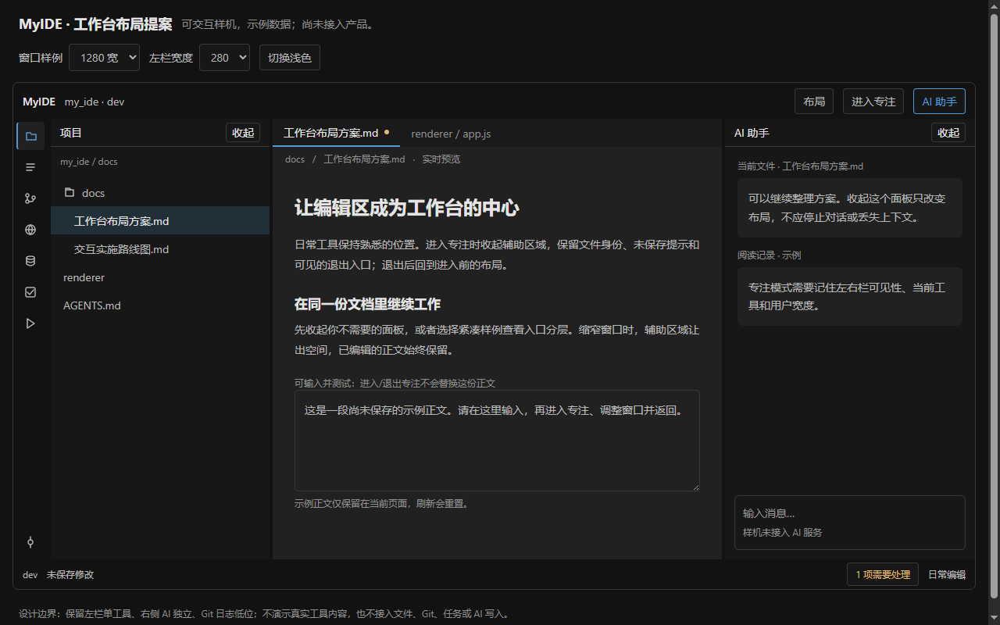
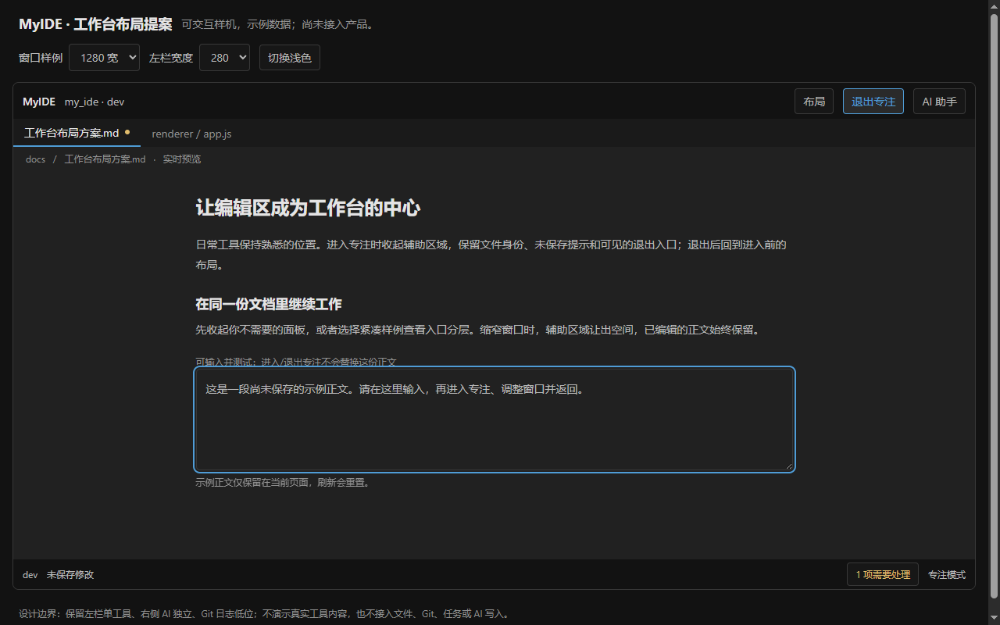

# 工作台布局与专注模式交互方案

> 2026-10-01；审查时HEAD `7e535e9`，另有并行产品修改。承接[103](./开发文档-103-UI交互与新增功能改进方案.md)的U1/F4/UI-01。本文交付独立可交互样机与后续方案；未更改产品App、布局样式、快捷键或用户配置。

## 1. 本轮可评审成果

[打开布局样机](./prototypes/workbench-121.html)：可切换日常/专注、明暗、窗口样例、左栏宽度、紧凑示例和更多工具，输入正文后切换布局，检查内容保留。样机无外部资源、无文件/Git/AI接口、无持久化；刷新重置示例输入。工具内容是占位数据，不能据此宣称数据库、浏览器、Git或AI功能已经接入。

日常布局与专注布局的设计截图如下，截图中的状态与数据均为样机：

这两张PNG作为本文正式设计附件保留，不属于待清理的临时验证截图。默认工具仍完整显示，左栏单工具、右侧AI独立、Git日志低位这些既有习惯保留。紧凑示例收纳部分入口只是可评审候选；实施时由用户选择显示集合，不替用户判断哪些工具低频。样机左/右280/320用于比较布局，不意味着产品默认340/380已改变或应该强制改变。

## 2. 当前能力与证据

| 已有能力 | 当前来源 | 后续处理 |
|---|---|---|
| 左工具互斥、AI独立、工具按钮重复点击收起、showTool快捷入口始终显示 | app.js的switchTool/showTool/setAiOpen/renderToolStrip | 保留按钮切换与快捷显示的不同语义；“显示”必须让实际面板可见 |
| 左/右栏整体收起与展开 | toggleSidebar/toggleRightSidebar；Ctrl+`/Alt+` | 专注模式复用布局状态，不拼几次toggle假装保存了快照 |
| 按项目记住activeTool/sideTool；AI开关全局记忆 | saveToolState/restoreToolState、myide-ai-open | 不重造“记忆当前工具”；补尺寸、可见性、临时模式的范围定义 |
| 左340（260–480）、右380（320–520）、拖动与双击复位 | App.LAYOUT、styles.css、ai-panel.js | 补总宽度预算与键盘操作，默认值与CSS继续同源 |
| 项目栏滚动/全部项目入口、标签滚动、深浅主题与焦点样式 | App项目栏、Viewer、styles.css | 拥挤程度按窗口截图测量，不用统一换皮替代具体问题 |

### 2.1 原模块受控观察

agent-browser默认headless Chrome加载原index.html、完整styles.css、完整App模块；Tree/Viewer/AI/配置等外部桥为内存桩，列表与正文为示例。静态取证页为执行桩移除了CSP、原脚本加载项，未改原App算法或原布局CSS。它支持真实浏览器布局/点击观察，但不是生产Electron窗口、NativeView遮挡、系统焦点或安全策略验证。

| 编号 | 操作/实际观察 | 意义 |
|---|---|---|
| R1 | showAi开启后toggleRightSidebar(true)，再showAi；AI仍display:none，而工具按钮active=true。调用路径与shortcuts.js的显示AI入口对应 | showAi只检查aiOpen，未解除右栏整体收起；逻辑开启与实际可见不一致 |
| R2 | 1280×800、左右栏设合法上限480/520；真实getBoundingClientRect正文宽200，截图标题/段落明显频繁换行 | 两栏单独合法，不保证编辑区可用；需要联动预算，不能只调单边默认值 |
| R3 | 左分隔线为DIV、tabIndex=-1、role为空；源码只绑定鼠标拖动/双击，没有键盘处理 | 鼠标调宽有能力，键盘调宽仍是缺口；首包可提供带数值的布局设置，后补可访问分隔线 |
| C1 | 原项目按钮再点后activeTool=null；重复两次showTool(project)后仍project | 既有按钮切换/快捷显示有效，不把这种区别写成错误 |
| C2 | 左栏480后触发原双击分隔线，样式复位340px | 默认复位已实现；新增“重置全部布局”需要更广的可见性/工具合同 |
| C3 | 普通340/380双栏在1280宽时正文480；工具按钮可由title得到名称，活动状态仅class且aria-pressed为空 | 默认布局不是普遍不可用；补状态语义不能宣称当前按钮完全无可访问名称 |

执行前后源SHA-256一致：index `1c20f93a7caf96493096e519f560de70465e1cd7c2f0721c5bd9e2474db93d76`；styles `5f4fb1bd15f12ead21fa8fff2e1dd70ecde356b0fccf12d58d05d57f26936271`；App `721defa7514c51ed51ddaf4067d287058fc1443fa78aa66262672c2dfe135cc0`。一次性取证生成器、HTML与临时截图收尾删除；表中步骤及源码路径可重建观察。

Viewer.openFile当前特意只让浏览器/任务图让位，数据库保持既有行为；不能为新增“返回编辑器”擅自让所有工具退出。大纲曾被用户要求从项目树下移除，本方案保持独立，不恢复上下分栏。

## 3. 成熟项目参考

| 官方来源（2026-10-01核对） | 借鉴点 | MyIDE取舍 |
|---|---|---|
| [VS Code Custom Layout](https://code.visualstudio.com/docs/configure/custom-layout) | 独立侧栏、布局控制、恢复默认、居中/专注入口；文档的现代UI布局密度明确为实验性 | 借可发现、可恢复的操作方式；不引入任意停靠/编辑组重构，不把实验性密度当行业固定规范 |
| [IntelliJ查看模式](https://www.jetbrains.com/help/idea/ide-viewing-modes.html) | 全屏、无干扰、演示、紧凑是不同模式，专注仍可通过动作找工具 | 第一包专注不强制全屏、不自动放大字号；文档列宽与Markdown排版继续沿083，不用布局功能重写正文主题 |
| [IntelliJ工具窗口](https://www.jetbrains.com/help/idea/tool-windows.html) | 隐藏所有工具后恢复、工具名字可见、在编辑器/工具间返回焦点 | 保留MyIDE键位与停靠关系；组合布局快照和显式退出比逐一toggle更可靠 |

## 4. A包：布局状态和“显示”的一致性（P1）

将用户期望与有效可见分开：`desired`包括当前左工具、左右栏开关、手动宽度、底部日志开关/高度、工具入口集合、密度；`effective`由可用视口、专注等临时模式派生。工具运行状态/AI生成状态不属于布局；hide只影响呈现，不能清除对话、取消任务或停止用户服务。

showTool/showAi必须解除阻挡该面板的折叠状态；UI高亮与aria-pressed/expanded表示实际可见或明确区分“正在运行但已隐藏”，不能暗示已经显示。右栏入口显示AI的文本和逻辑一致；已收起时再按显示快捷键须展开。重复显示保持幂等，按钮重复点击仍切换。

定义持久化范围：项目绑定工具选择/命名布局；全局绑定默认密度、用户宽度与工具入口集合；临时专注和视口自动收起不写回用户期望。现有myide-ai-open全局规则先保留，改为项目规则需要单独迁移说明。布局状态按schema版本校验，未知工具忽略并保留可恢复默认；不能把width新键版本迁移当唯一设计。

**验收**：R1/C1；AI开/关×整体收起/展开四组合、反复快捷显示、鼠标切换、切项目/重启；面板可见和高亮一致，用户AI会话、运行任务、dirty正文没有被关闭布局影响。

## 5. B包：专注模式（F4，P1）

用户点“进入专注”后，捕获布局快照和当前文档身份/焦点锚点，仅隐藏辅助区域。保留当前文件名、dirty提示、保存失败入口和“退出专注”按钮，不要求用户记第二个快捷键才能离开。代码长行保持正常滚动；Markdown阅读居中可复用现有列宽，不能额外扩大正文字号/内边距导致live与preview不一致。

退出恢复进入前的工具、期望可见性和尺寸，随后依据当前视口计算effective；窗口变窄时不能恢复出挤坏的编辑区。重复进入不覆盖第一次快照，退出幂等；模式内打开一个工具建议退出专注再执行原show动作。调整布局也先退出再应用，避免“临时修改到底写到哪一份快照”的歧义；改变窗口大小保留，不恢复窗口几何。

切项目先退出原项目专注再恢复新项目布局，不将A的工具快照写进B。退出不重开文件、不自动保存或丢弃输入。Esc优先处理IME/编辑器当前弹层/模态栈，首包不强抢Esc为退出专注；专注快捷键接105动作注册表，核对冲突后分配，不照搬VS Code Ctrl+K组合键。

**样机实测**：输入中文正文后进入，左右栏隐藏、焦点到draft、失败入口仍在；退出恢复两栏，正文不变，焦点到退出触发按钮。打开失败说明后Esc只关闭dialog并回needs按钮，专注保留。样机演示的是DOM节点保留，实际CM6选择/滚动、原生浏览器隐藏生命周期仍按106/096/101实施验收。

## 6. C包：窄视口与宽度预算（P1）

由视口可用CSS像素预算，不只看物理窗口最小宽度。当前main.js工作区配置minWidth=960，但缩放、高DPI和双栏上限仍需实测，不能认为设置了窗口下限就不会挤正文。

先定义内容可用宽度，再限制拖动与恢复：`编辑区 = 可用宽 - 左右工具条/分隔 - 有效左栏 - 有效右栏`。样机采用380作为阅读目标的候选，尚非产品最终阈值；Git双栏、数据库表、Markdown分屏分别做样机验证。新默认宽度无需与算法一起强制改变；拖动到预算边缘应停住并解释，而不是让另一栏在拖动中反复跳变。

窗口缩窄时，优先暂收非当前交互面板；用户明确打开AI时可暂收左栏以展示AI，反之同理，宽度恢复后依据desired还原。自动收起不清用户手动偏好，手动关闭后变宽不能重新打开。必须提供可见说明、对应工具入口和操作反馈，避免R1“显示了但其实看不见”。若任何单个侧栏都放不下，评估覆盖式抽屉或只显示单工具页面；样机在很窄的评审宿主先提示扩大预览并收两栏，不代表产品已实现抽屉。

**样机实测**：960宽/左480时AI自动隐藏，编辑区426；主动点AI后左栏暂收、AI显示，编辑区586；回到宽窗口/280左栏恢复双栏。640评审宿主回落为正文555并解释暂收。截图已看正常、专注、浅色及960宽样例；只有这些尺寸/主题是本轮实测，125/150%与真实Electron尚待。

**验收**：960/1280/1920窗口、100/125/150%缩放、左右最小/默认/最大、Git日志高度叠加、长中文、跨屏DPI、从最大化恢复；当前文档与失败入口均能操作。用户拖动宽度、自动收起与专注恢复不能互相污染持久状态。

## 7. D包：布局入口、密度与键盘（P1/P2拆包）

首包顶部“布局”或105命令面板可发现左右栏开关、专注、默认恢复；不把全部功能塞进一排图标。默认保留所有已可见工具，用户可配置显示集合，隐藏项仍由“更多”与动作搜索进入；当前使用项不能因收纳突然失去活动标识。设置导入、改键与布局动作共用动作ID，沿116生效范围显示。

密度只调整UI行高、间距与图标容器，不修改编辑器/Markdown字号；默认密度与用户增大字号兼容，最小可点击区域和中文下伸区不能截断。样机compact由36→30行高示意，实际产品需截图验证不同面板后决定，不以这个数字作为强制全局token。保持内联SVG、活动/hover/keyboard focus区分，右键emoji惯例保留。

R3首包可在布局设置用数值输入/选择设置宽度、键盘复位；第二包分隔线设置focusable separator、方向键步进、Home/End边界、可播报当前宽度，并支持指针捕获/取消。调宽时不抢编辑器方向键，实际读屏与系统焦点单独验收。工具按钮明确名字、位置和状态，不能仅添加aria属性就宣称可访问性完成。

**样机实测**：布局对话框Esc返回触发按钮；紧凑后从更多打开数据库，当前数据库入口保留活动显示；恢复默认后所有原工具重现且测试正文保留。没有模拟真实DB内容，不能以此证明产品的工具路由或快捷键已改好。

## 8. E包：命名布局候选（P2）与实现顺序

命名“写作/代码审阅/数据查询”等布局省掉每天重复调栏动作，但不等于现有按项目记住activeTool。最小版本存工具/可见性/用户尺寸/密度，能预览、应用、复制、删除、恢复默认；明确全局模板与当前项目应用。它不保存文档正文、数据库连接密钥或AI会话，不自动启动服务。模板引用不可用工具时显示原因并安全回落，不暗中装插件。

建议先A修显示语义和状态来源；B交付专注并保持正文；C交付预算和手动意图；D分期做可发现入口/键盘/可选密度；最后E命名布局。每包可独立提交，视觉token与原工具数据合同分别验收，避免以布局改造为由重写所有模块。

正式实施还需headless check-ui并看截图、真实系统焦点/IME/缩放、CM6/Markdown各模式；涉及浏览器时补096 NativeView/overlay生命周期。样机截图不能代替这些产品测试。

## 9. 本轮验证与收尾

后台同一npm test session退出0：check:js40文件；Git62/0、DOM344/0、package47/0、files46/0/2跳过、text49/0、paths18/0及jobs5/0、create19/0、copy19/0、delete19/0。这些测试针对运行时工作区，包含其他并行修改，不证明本文实现了产品布局，也不推翻120记录的受控Git问题。上一轮删除/保存失败未在这次运行中出现，不能仅凭此宣称相关工作已完整闭环。

样机脚本独立语法/UTF8检查通过；agent-browser headless验证交互、测量和截图，未调用用户真实服务、文件写入或配置。正式附件是121文档、HTML及两张设计PNG，103增加入口；只提交这些自己的文件。清除自己的临时生成器/页面/日志/截图并关闭独立浏览器session，按仓库要求commit/push核对和重启MyIDE。持续目标保持进行，后续优先把模块级方案补成可评审场景与明确验收。
