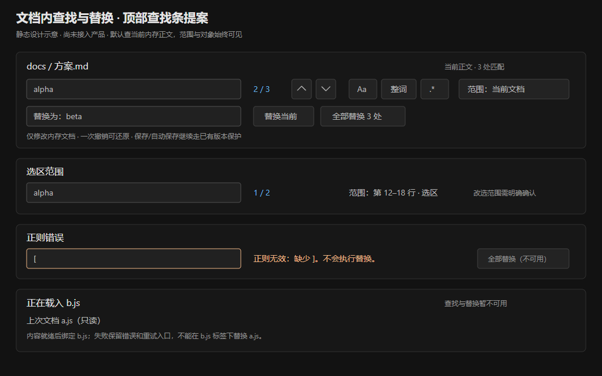

# 文档查找与替换范围交互方案

> 2026-10-01；审查时HEAD `942fc45`。承接[027早期查找条](./开发文档-027-查找替换.md)、[103体验总方案](./开发文档-103-UI交互与新增功能改进方案.md)；[105](./开发文档-105-命令面板与常驻搜索交互合同.md)管项目搜索与动作发现，本文管当前文档。交付取证、静态UI示意和后续方案，没有修改查找/替换产品代码。

## 1. 可评审UI与用户任务

[可编辑SVG](./prototypes/find-124.svg)与PNG作为正式设计附件保留；它们是静态示意，按钮不能执行产品操作。正常匹配、选区范围、正则错误、加载新文档分别显示，不以同一个“0/0”解释所有状态。新增需求来自三个任务：长文档中快速确认匹配；只替换某一段内的词；预览阅读时也能找到可见文字。先保证改对对象和位置，再改善发现/反馈，最后扩展范围能力。

## 2. 现有能力不是027时的单一查找条

| 模式 | 当前实现 | 已有/缺口 |
|---|---|---|
| 普通源码文件 | Viewer.renderCodeCm→CodeEditor；openFind委托cmApi.find | CM6内建搜索、大小写/正则/整词、选中文字带入、匹配导航、替换/全部替换、撤销已有；本轮实测其中部分 |
| Markdown live/source | MdEditor与同一CM6搜索扩展 | 不是另造Markdown搜索引擎；底层搜索的是Markdown文档模型，装饰隐藏的标记也可能命中，需明确范围 |
| Markdown split | Viewer的textarea与findState | 中文条、大小写敏感字面匹配、计数/导航/替换已有；没有与正文变化同步匹配缓存 |
| 纯preview | 无CM6，正常入口提示“请在编辑视图中查找” | 只读预览查找是新增候选；split切preview另有残留ta/findState错误 |
| 项目搜索 | Ctrl+Shift+F/Search模块 | 091/105的跨文件结果，不能直接当成本文件替换范围；全项目替换仍按103 F6另包 |

027是早期完成记录，不能再据它推断所有模式都只有indexOf。Ctrl+F/Ctrl+H入口仍沿现有快捷键注册表；本轮不增加第二套全局键位。

## 3. 当前实现取证

agent-browser默认headless Chrome载入原index/styles、完整Viewer/CodeEditor/MdEditor/Shortcuts/TextLines/DocumentPaths、实际vendored CM6与marked。只将App/Tree/Session/MI及文件桥设为内存桩；内容为a.js/b.js/a.md样例。预览由实际marked生成HTML、外部渲染路由为桩；不能据此验证整个正式Markdown插件，但openFind的路由和分屏正文算法未经改写。

临时页面为执行桩移除CSP与原脚本加载项，生产文件不变；查找/替换只改变内存文档，自动保存如果触发也止于内存writeFile桩，没有真实文件/用户配置/Git操作。没有真实Electron、IME输入法、系统读屏或保存失败/原字节对拍。

| 编号 | 步骤与实际观察 | 改进结论 |
|---|---|---|
| R1 | a.js已打开，令b.js读取挂起并openFile；activeTab=b.js、mode=null，cm.__tab仍a.js。openFind(true)后从真实搜索输入alpha/OMEGA并点replace all；a的三个alpha/Alpha变OMEGA，b.content仍null | 新标签加载期间查找/替换错绑定旧编辑器；写动作须校验owner和当前文档就绪，不能只依赖全局cmApi存在 |
| R2 | a.md split查alpha，第一匹配[8,13]、计数1/2；正文前插入前缀并触发真实input，旧范围处现为“# 查找验”；点替换当前后该标题片段变OMEGA，两个原alpha仍在 | findState.matches未随文本变更刷新；直接复用旧offset会改错文字，需要revision、范围映射或重新计算 |
| R3 | split内有查找条，切preview并renderActive；再次openFind抛`Cannot read properties of null (reading 'focus')`，tab.ta.isConnected=false、find-input不存在 | 模式切换移除DOM但留下findState/ta；生命周期必须闭合，不能认为有ta就有当前编辑器 |
| R4 | split正文11000次x；查找显示1/10001、没有截断说明；全部替换为y后实际11000次都变y，显示0/0 | 显示的匹配数与真正修改范围不一致；计数/限制/全部动作需同一快照与完整范围定义 |
| R5 | 原CM6输入`[`并勾regexp，getSearchQuery.valid=false；无可见错误文字，aria-invalid空，导航/replace按钮均未disabled | 需要可见正则错误与不可执行原因；底层valid=false已经存在，不必新造正则校验引擎 |
| R6 | 普通源码openFind(false)显示英文Find/Replace、next/previous/all等，replace行仍可见，没有匹配计数或范围说明；live同样显示replace | 能力已有，但与中文split条及“查找/替换”分层不一致；这是UI改进点，不等于CM6替换算法坏了 |
| C1 | 选中a.js的alpha再openFind，输入框自动alpha | 选中词带入已有，不列成从零开发 |
| C2 | 原CM6查alpha，不区分大小写3处；勾match case变2处，由真实SearchQuery cursor计数 | 保留大小写和匹配引擎；计数可接真实模型，不重新用字符串算法并行算一份 |
| C3 | 原CM6将3处alpha/Alpha全部换OMEGA，调用一次Commands.undo恢复完整原正文 | 单次全部替换的撤销已有正向能力；新UI不能拆成多次不可预测的undo |
| C4 | live原生面板有效；从live切preview时ta=null/cm不存在，openFind正常提示编辑视图 | preview缺少查找是功能边界；R3是split残留状态的特定失败，不能说所有预览查找都会抛错 |

上述10项受控观察成立。R1/R2明确实际内存正文变化，但不等于已在真实磁盘重现误写；真实保存保全仍按101/107/110/111合同验收。另有一轮浏览器session后来回到about:blank，原因未确证；检查当前URL和tab后重新加载隔离页再完成C3/C4，不将失去上下文时的工具错误计为产品缺陷。

取证前后9个原文件hash相同；重点SHA-256：Viewer `6037be5b044be9627c01d925340847f6f863deb3a11d8def9f64a932eaf2c58a`；CodeEditor `b25b9a216cefd950833e7e73f3f2e978b8fc3655403ae9683a170951fe4e4341`；MdEditor `48840f157f06e845e2e13a48e41ec96b3124df6f6ab4e2196024f3441cd801f3`；CM6 bundle `1e7640d49031843ba4b34b6dc64aca2bbae0d0e5c19533bb011298c1f54371ae`。临时生成器/页面/hash文件按约定删除，表中内容与步骤可重建。

## 4. 成熟项目参考

| 官方来源（2026-10-01核对） | 可借鉴能力 | MyIDE边界 |
|---|---|---|
| [VS Code本文件查找](https://code.visualstudio.com/docs/editing/codebasics#_find-and-replace) | 当前匹配导航、选区范围、查询历史、多行输入、大小写/整词/正则及替换的清晰控制 | 高级匹配和选中词带入部分已由CM6提供；新增重点是范围/历史/中文呈现，不复制默认组合键 |
| [IntelliJ文件内查找](https://www.jetbrains.com/help/idea/finding-and-replacing-text-in-file.html) | 选区查找与替换、跳转时是否自动滚动、历史、多行字符串、匹配列表 | 按日常文档工作流分期，不附带语言符号索引或项目替换 |
| [CodeMirror搜索官方源码](https://github.com/codemirror/search/blob/main/src/search.ts) | SearchQuery状态、cursor、setSearchQuery、原生命令与自定义面板接入点 | 官方仓库参考不等于本地bundle版本；以本地实际API导出和回归为准，复用引擎/事务，不改minified产物 |

CodeMirror参考手册页面本轮403，改核对官方仓库源码与本地实际API；不能声称在线文档已完整读取。官方示例只是接入思路，不直接引入依赖升级或另一种正则语义。

## 5. A包：文档归属与替换版本（P0先修）

每次查找条/命令绑定`projectGeneration、tabId、pathGeneration、editorInstance、documentRevision、mode`。入口先确认activeTab已就绪、cm.__tab或ta所有者确实是该tab，且DOM连接有效；点击替换再次验证。键盘原生搜索命令也要经过可编辑状态，不能只挡Viewer.openFind而让旧CM6快捷键继续改旧文档。

新标签加载时可以保留旧画面减少闪烁，但必须明确旧文件身份并只读，当前标签显示加载中；就绪后再启用编辑/查找/替换。失败保留原因/重试，不将旧正文重新命名为新文件的内容。期间不能把旧匹配和替换输入派发给新对象；若用户返回a可按a的查询状态恢复。

匹配模型与正文版本同源。textarea的每次input、替换、外部重载、撤销都更新revision与匹配；执行当前替换时校验当前位置仍匹配当前query，不匹配则重新定位。保留合法编辑后的查询，当前匹配按映射或当前位置邻近规则恢复，不能继续用旧数组offset。模式切换销毁查找DOM时注销handlers/findState并清除失效ta；逻辑查询状态按tab保存，DOM不保存为长期身份。

全部替换使用同一文档/范围/query/replacement快照，完整计算影响数与变更；内容或选区变化即重新计算/重新确认。R4不能用10001计数引导实际改11000处。若大文档只完成部分计数，显示“至少N处/统计中”并禁止未经完整计划的全部替换；不把有上限的结果集合当完整文档。不要用截断成10001处替换作为更容易过测的修复，用户明确的“全部”仍需完整且准确的合同。

**验收**：R1–R4；新标签/旧编辑器、a→b→a、迟到读、切模式/项目、编辑/撤销后匹配、外部版本变化、重复点击；零长匹配、emoji代理对、组合字符、LF/CRLF/混合行尾。CM6事务、TextLines原格式与保存队列一起验，不能以正确内存字符串替代原字节保存验证。

## 6. B包：中文查找条与可理解状态（P1）

统一交互模型，按能力适配CM6与textarea，复用CM6 SearchQuery/cursor/replace命令和历史。可先以EditorState.phrases等支持的翻译入口补中文，再接完整自定义面板；保留已有高级开关与选中词带入。不要为了外观统一用indexOf替代CM6正则/整词，再维护两套不同匹配结果。

Ctrl+F打开简洁查找行，Ctrl+H展开替换行；保留当前query并聚焦相应输入。顶栏显示当前文档路径/模式、当前匹配/总数、范围；上一/下一匹配用现有线性SVG，title同时解释键位。统计中、未输入、无匹配、无效正则、当前文档加载中分别显示。失效查询与空结果的写按钮不可用并给原因；错误文字可读、aria-invalid/关联说明可播报，不只红框。

Enter/Shift+Enter在查找框导航，替换框Enter仅替换当前，Ctrl+Enter多行候选先核对原键位与输入法；composition期间不执行导航/替换。Esc依弹层优先级关闭当前条并回原编辑选区，不关闭标签。当前匹配高亮与其他匹配分层，滚动到结果可关闭跟随；实际点击上下项应滚到当前对象而非只改不可见selection。

显示“全部替换N处 · 当前文档/选区”，完成后显示本次实际数量和撤销入口；没有修改时明确0处，不以toast称成功写盘。内存替换仍触发既有dirty/自动保存队列，不绕过101/110/111结果和版本保护。大规模或复杂正则可提供轻量前后差异预览，确认绑定原计划；普通单次编辑不强制每次弹确认。

**验收**：R5/R6/C1–C3；中文/英文/长查询、深浅主题、380/600/1000编辑区、100/125/150%缩放、输入法、regex语法错、零匹配、结果统计中；实际CM6各模式与textarea对拍。静态示意尚未验证这些产品视觉门槛。

## 7. C包：选区范围与查询历史（P1/P2拆包，新增能力）

第一包显式“当前文档/选区”范围；捕获编辑器当前选区，显示行号及多选区数量。查询词带入和范围限制是两个动作，不能把选一个词自动解释成只查这一个词。首版可以单选区，遇多光标明确说明支持范围；后续按互不重叠区间归并，不重复替换交叠部分。

查询输入夺焦点后选区仍以版本化范围存在；正文变化时映射范围，变化跨越边界或无法确认时显示已失效并重新选择。不能把下一条命中selection当原范围而越搜越窄。切文档/项目不带入旧offset，回原文档恢复合法范围；关闭范围明确回整份文档。

第二包查询/替换历史，可选仅会话或按项目保存，上限/清空入口明确；不默认永久收集可能含密钥的替换文本。选历史只填输入，不立即执行替换。多行查询沿现有引擎行分隔语义，清楚区分字面`\\n`与换行；保留大小写/P2正则替换引用规则，以真实SearchQuery语义为准。保存模板候选后排，不引入团队同步。

**验收**：完整文档3处/选区2处只改2处，范围外正文不动；输入后选区仍稳定，映射失效不得执行；历史跨项目隔离、清空、重启政策、literal/regex、空替换、复制多行与IME分别记录。

## 8. D包：只读预览查找（P2，新增能力）

纯Markdown预览Ctrl+F查可见文字，显示“预览文字（只读）”；Ctrl+H说明切到可编辑模式，不在DOM节点上替换源码。源码/live搜索Markdown文档模型，隐藏的语法或链接目标可命中；两种范围必须可理解。首包只支持内置Markdown预览，Office/PDF/HTML iframe插件各自能力核对，不能宣称统一搜索所有预览。

构建可见文本索引及DOMRange：包含可见标题、段落、表格、代码；跳过script/style/hidden节点，链接按可见label，隐藏URL不算可见文字。跨节点匹配必须正确，不能逐元素检索导致重复/漏匹配；高亮用不破坏渲染结构的方法，取消恢复原样。预览重建后索引代次失效，切文档不能滚旧DOM。

“在源码中查看”需要真实Markdown位置映射；没有准确映射时只切模式并保留查询，不猜一条行号。预览匹配标题/表格/脚注等转换节点要单独验，099的标题索引不能代替全部文本映射。图片alt、折叠区域、嵌入文档先明确纳入政策，再提供开关。背后编辑正文/外部刷新后高亮重算，不能脏输入被旧预览覆盖。

**验收**：C4；可见label/隐藏href、加粗跨节点、中文/emoji、表格/代码/脚注、内容刷新/重建、取消/恢复阅读位置、live/source/preview/split往返。改Markdown显示需083一致性/check-live，NativeView/iframe另沿096，不借查找功能改动排版。

## 9. 排期、验证与收尾

先A两个P0独立修归属与旧匹配，再A生命周期/完整计数；B翻译和状态可并行做不触碰写入的小包，随后完整统一条、C选区/历史、D只读预览。每包1–2个可见变化。用户实际收益以搜对对象、替换数与范围准确、能返回原位置来验，不以“控件更多”验收。

后台第一次npm test退出1：语法44、Git61/1，失败是现有M3块测试未传原展示快照身份；后续DOM及套件未执行。观察到并行Git服务/测试继续修改后重跑，同一第二session退出0：语法44；Git62/0、DOM344/0、package49/0（96运行时资源）、files46/0/2跳过、text49/0、paths18/0及jobs5/0、create/copy/delete各19/0。后次全绿证明当时测试链通过，不证明R1–R6已修；本文未改产品代码和这些测试。

SVG已在headless浏览器实际渲染、查看PNG，UTF8与文档链接收尾核对；示意不是产品截图。9份源hash未变，自己的取证页/生成器/hash/日志和临时截图清理，正式SVG/PNG保留。只提交124、103/027入口及设计附件，推送核对后按要求重启MyIDE；其余并行工作不混入本轮提交，持续目标继续。
