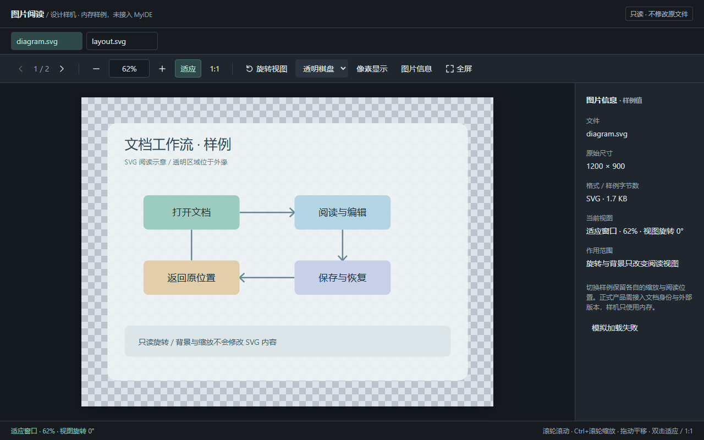

# 图片与图表阅读交互方案

> 2026-10-01；审查HEAD `e84a562`。承接[049已实现缩放与全屏](./开发文档-049-图片缩放与图全屏.md)、[103体验总方案](./开发文档-103-UI交互与新增功能改进方案.md)、[121工作台布局](./开发文档-121-工作台布局与专注模式交互方案.md)。本轮交付原模块取证、可交互设计样机与分包方案，没有修改图片/图表产品代码。

## 1. 可评审设计与用户任务

[打开可交互HTML](./prototypes/image-125.html)；[640px旋转示意](./prototypes/image-125-narrow.png)、[失败与重试示意](./prototypes/image-125-error.png)。正式设计附件保留，图片是样机截图，不是MyIDE已实现界面。HTML使用两份内嵌SVG、内存状态，无文件桥、网络请求或持久配置；元数据只属于这些样例。

三个任务：读大图的一小块后切文件再回来；确认素材尺寸与透明边缘；连续查看同目录图片或横置截图。对应新增候选是图片信息、背景/像素显示、只读旋转、连续浏览；已有缩放与全屏改交互，不重造图片编辑器。常用控件保持可见，元数据放可关闭详情；不能为了照片更大而把全部入口变成只悬停可发现。

| 方向 | 用户可见变化 | 少做的操作 |
|---|---|---|
| UI | 匹配当前文件的尺寸/格式/字节数、缩放方式与比例、旋转角度；加载/失败/重试区分 | 不必离开IDE查看文件属性，不靠裂图猜原因 |
| 交互 | 切回恢复原阅读位置、全屏键盘只作用于当前实例、关闭返回原焦点与视图 | 少反复放大/拖回同一细节，不让背景控件截走操作 |
| 新功能 | 棋盘/白/深背景、像素显示、只读90°旋转、同目录上一/下一张 | 素材检查和连续阅读不必反复外部打开或点树 |

## 2. 已有能力与边界

| 能力 | 当前实现 | 保留/新增判断 |
|---|---|---|
| 图片标签预览 | plugin-loader内置png/jpg/jpeg/gif/webp/svg/bmp/ico渲染器，Viewer跳过文本readFile | 已有，不列“新增图片预览”；扩展名注册不保证每种文件变体都可解码 |
| 缩放/适应/1:1/全屏 | buildImageViewer→createZoomer→showImgLightbox | 全部已有；5–1600%限制、小图适应不放大也已有 |
| 平移/双击 | 普通滚轮交原生滚动，Ctrl/Meta滚轮锚点缩放；溢出时左键、中键平移；双击适应↔100% | 保留用户049明确要求，不能改成普通滚轮缩放 |
| 图表全屏 | attachMermaidFullscreen，showSvgFullscreen克隆SVG | 已有；按钮hover与focus-visible可见，不误列完全不支持键盘发现 |
| 全屏按键 | +/−、0适应、1原始尺寸、Esc/空白关闭 | 已有。缺实例替换清理与Modal/focus归属，不是从零加入快捷键 |
| 背景 | 图片CSS白底 | 保留白底选项；棋盘/深色切换、像素插值是新增候选 |
| 阅读位置 | Viewer记预览根scrollTop；图片实际滚动在内层img-stage | 原根模型不足以恢复图片的横/纵平移与scale/mode，需要图片专属视图状态 |
| Markdown图片失败 | Markdown的md-img-broken占位已有 | 不把图片标签缺反馈推广成所有Markdown图片都没有错误态；内联与全屏仍需分别验 |

音视频、PDF、Office不在本包扩功能；119 Office阅读、096原生浏览器/浮层归属继续各自合同。图表用SVG逻辑单位，图片用解码尺寸，不能在所有对象上都把“1:1”称为物理屏幕像素。

## 3. 原模块受控观察

agent-browser默认headless Chromium执行原plugin-loader.js和Viewer，以及DocumentPaths/TextLines；用原index的tabbar/viewer/empty-state节点与原styles，移到固定尺寸隔离宿主。App/Tree/Session/Modal/文件桥是内存桩，日志不落盘。原渲染器与缩放器未经修改；浏览器实际解码本轮自建1200×900 SVG，另用不存在文件和包含`#`的同份样例。未使用真实用户图片或正式Electron profile；文件桥write调用0。

宿主初版把完整index放在错误几何中，舞台压到43px并出现RO通知错误；修正宿主为可用区域后重载，舞台1262×571、适应58.56%、无JS错误。该初版几何不计为产品缺陷。监听计数包装原生add/removeEventListener和ResizeObserver，RO仍委托真实浏览器；计数是该隔离宿主内的资源归属证据，不是整个应用内存基准。

| 编号 | 步骤与实际观察 | 结论 |
|---|---|---|
| R1 | 一个内嵌图基线mousemove/up各1、RO1。开图片全屏后keydown2/move2/up2/RO2；直接再showImgLightbox，同类浮层DOM仅1，但keydown4/move3/up3/RO3。发`+`后新/旧返回zoomer的scale都从0.6444到0.8056 | 替换只old.remove，没调用原close/destroy；隐藏旧图仍响应全局按键。不能据此声称显著性能卡顿，先修实例归属 |
| R2 | 隔离宿主按钮focus后打开全屏，document.activeElement仍该背景按钮，role与aria-modal均null；用真实CLI Tab转到背后的tab-locate按钮 | 全屏没有焦点进入/隔离。已证明DOM焦点漏出，不等于完成系统读屏/Electron焦点测试 |
| R3 | 图片全屏未关再showSvgFullscreen，同屏img-lightbox1/svg-fullscreen1；发一个合成Escape后二者都关闭 | 两类浮层各自“唯一”却不共享栈；该跨入口调用是受控交错，不声称鼠标一定能透过覆盖层再点另一图 |
| R4 | 原图片设200%、内层scrollLeft210/scrollTop260，activeTab.scrollTop仍0；原Viewer开另一图片再activate回来，原view断开，恢复58.56%且scroll0/0。监听move/up/RO从1→2→3 | 新建预览未恢复图片状态，也未销毁旧内嵌zoomer；不是普通文本预览滚动全部失效 |
| R5 | 原Viewer打开不存在的png，真实img.complete=true/naturalWidth0；画面空/裂图，条上100%，五个按钮都可用；无错误说明/重试 | ready/failed状态未与控件绑定；未知尺寸不应继续显示像成功加载的100% |
| R6 | 磁盘存在ui125-图#1.svg，与正常样例字节相同；原渲染器src变`…ui125-%E5%9B%BE#1.svg`、URL.hash为`#1.svg`，complete=true/naturalWidth0 | 本地路径手拼file URL把文件名变片段；特殊文件名需标准资源URL转换 |
| C1 | 原图派发普通WheelEvent，scale不变且未preventDefault；Ctrl+向上滚轮scale0.5856→0.7319并preventDefault | 已有滚轮语义有效；合成事件只验事件分支，不证明真实滚轮原生滚动，本轮未替代049真实Electron记录 |
| C2 | 原zoomer.reset回1；实际样例naturalWidth/Height1200×900 | 1:1与真实解码已有，不新造缩放引擎 |
| C3 | R1/R3后合成Escape执行各close；监听回keydown0/move1/up1/RO1 | 单个实例正常close能清理；问题集中在替换/预览销毁路径，不能说destroy函数本身无效 |
| C4 | 同一个含#磁盘文件，控制组把basename编码为`%23`后用原生Image加载，naturalWidth1200且URL.hash空 | 文件不是坏图；此为资源URL控制组，不是对产品渲染器的修复 |

6项问题与4项正向/控制观察成立。源文件前后6份SHA-256相同：plugin-loader `cc1d2052a3cf0296e2477746bddd5f3496e8b2c86501e0731284446c760d2548`；Viewer `6037be5b044be9627c01d925340847f6f863deb3a11d8def9f64a932eaf2c58a`；styles `5f4fb1bd15f12ead21fa8fff2e1dd70ecde356b0fccf12d58d05d57f26936271`。没有证明大图内存、真实保存或所有格式质量；本包不写回图片。

## 4. 成熟项目参考与取舍

| 官方资料（2026-10-01核对） | 支持的参考方向 | MyIDE取舍 |
|---|---|---|
| [JetBrains GoLand图片设置](https://www.jetbrains.com/help/go/settings-images.html) | 透明棋盘、像素网格门槛、Ctrl/Cmd滚轮缩放、外部编辑器配置 | 保留本项目滚轮语义，增加背景/像素显示；暂不加完整外部编辑器配置页 |
| [VS Code图片预览官方源码](https://github.com/microsoft/vscode/blob/main/extensions/media-preview/media/imagePreview.js)、[尺寸状态项](https://github.com/microsoft/vscode/blob/main/extensions/media-preview/src/imagePreview/sizeStatusBarEntry.ts) | 缩放/offset状态保存、解码尺寸消息、loading/error状态与高倍像素插值 | 是可核对的实现参考，不是本地API；MyIDE复用自己的zoomer，不引入VS Code扩展运行时或照搬普通滚轮行为 |
| [Apple Preview旋转/翻转](https://support.apple.com/guide/preview/crop-resize-or-rotate-an-image-prvw2015/mac) | 图像旋转有明确入口，也可结合缩略图批量处理 | 只借阅读入口；MyIDE首包旋转明确只改视图，不复制该产品的文件编辑/批量保存能力 |

来源只支持具体行为，下面的范围、版本身份、控件位置和排期是本项目提案。棋盘不是识别alpha的证据；像素插值也不是新增像素网格，网格若做需独立定义。

## 5. A包：实例生命周期与焦点（P1先修）

保留createZoomer，在内嵌预览根登记可幂等dispose，Viewer替换/关闭/切项目前调用；图片load/error、全局mousemove/up/keydown、RO都归该实例释放。现有close/destroy复用，不能只remove DOM。普通预览渲染器也需要共用销毁接入点，沿095插件生命周期，首包先闭合内置图片，不要求重写整个插件平台。

图片与图表全屏共享一个阅读overlay owner，绑定projectGeneration/tabId/pathGeneration/renderGeneration和入口焦点。打开新图先dispose旧实例；关闭/项目切换/文件移除都走同一终态。新decode迟到不得刷新后来图；关闭后也不能持有窗口事件操作断开DOM。全屏实际是应用窗口覆盖层，文案说明，OS原生全屏另算能力。

接现有Modal/浮层优先级，进入后focus到关闭或画布，Tab/Shift+Tab只在有效控件循环，背景不交互；Esc仅处理栈顶阅读层并停止同一次事件继续关闭别层。关闭恢复仍连接的原入口；入口已移除时回当前文档区域。按键豁免输入/textarea/contenteditable和composition，＋/−/0/1只对当前图片；应用快捷键不能绕过顶层阅读上下文执行后台动作。原生BrowserView叠层还需096 host overlay，不能仅提高z-index声称已遮住。

**验收**：R1–R4；图片→图片、SVG→SVG、图片↔SVG、打开/关闭100次，切标签/项目与迟到decode，move/up/RO/keydown回基线；无旧对象变化、事件不双派发。真实Electron验证Tab/Shift+Tab/IME/Esc、背景键位与关闭回焦，隐藏窗口焦点不可测时明确SKIP。

## 6. B包：资源加载与图片信息（P1可见收益）

将本地路径转资源URL交统一宿主能力，优先标准pathToFileURL等等价实现，经已有受信文件桥提供；不为此打开renderer Node权限。Windows盘符/空格/中文/#/%/?、UNC与长路径分别验；本地文件名与Markdown链接锚点分开，不能全量字符串替换后破坏合法外链或重复编码。

状态是loading/ready/failed，绑定当前file/version与decode代次；load失败显示文件名和可回看的原因，提供重试/复制路径/现有定位入口。没有足够证据时只说“无法加载”，不猜权限或格式损坏；错误码来自桥或解码实际结果。未ready禁缩放/旋转/全屏，未知尺寸与文件大小显示“待加载/未知”，不能显示0KB或可靠100%。外部更新只刷新仍归该对象的预览，保存阅读锚点或说明内容已改变。

ready后展示解码宽高、格式和实际文件字节数；stat/version和decode分别持有来源，stat失败不抹掉能看的图片。SVG有无固定width/height与viewBox、ICO多尺寸、EXIF方向都需解释，不把SVG布局尺寸误作一张原始栅格；首包保证普通PNG/JPEG/WebP/GIF明确尺寸，特殊格式显示能力边界。1:1按图像逻辑像素映射CSS像素，系统缩放/devicePixelRatio与高DPI下不能宣称物理像素一一对应。

顶部工具条不覆盖图片关键内容，比例可输入且限制/无效输入有就地反馈；适应与自由比例状态可见，图片信息可折叠。低频项按真实窄视口放更多或换行，主缩放/适应/全屏保持键盘可达。新按钮沿1.4px内联SVG；不将旧⛶/字符改图标当整包完成。

**验收**：R5/R6/C4；坏文件/不存在/拒绝访问、可重试成功、迟到stat/decode、源文件外部变化；特殊路径真实临时文件+宿主URL对拍。尺寸与stat实际值一致；窄编辑区380/640/1000、深浅主题、100/125/150%截图。HTML样机没接真实失败桥，不能替代这些门槛。

## 7. C包：阅读位置与只读素材检查（P1/P2拆开）

每份图片视图状态包含mode(fit/free)、scale、旋转角度、阅读锚点/scroll。按稳定文档身份与内容版本保存，不能只用DOM或新tab数组序号；切回同文件恢复，重命名沿112迁移，外部新版按尺寸和原锚点可映射时恢复，否则适应并说明。第一包会话内恢复，不默认存所有图片的无限历史。

fit随可用区变动重算，free保留比例；工具栏/详情开关要计入舞台，不把图推出左上角。全屏首版继承现有适应逻辑，退出恢复进入前内嵌快照；也可明确选择继承当前视图，两种策略必须一致，不悄悄覆盖原标签的scale/scroll。样机全屏沿进入快照、退出恢复；它不决定正式产品默认缩放策略。

背景切换棋盘/白/深，只改view；白色边缘、深色图标与透明外缘能检查，棋盘不能混入复制/导出的图片。像素显示切换image-rendering，仅影响放大插值，不承诺色彩管理或像素取色。像素网格是后续独立项，只有栅格/足够放大才出现，不能在SVG或缩小图叠同等网格。

只读90°旋转需旋转后的包围盒参与fit、滚动范围和锚点变换，不能仅transform使角落不可达；四次回原方向。元数据同时显示原始尺寸与视图方向，含EXIF的图以浏览器已解码方向为基准，避免双转。对GIF可保留原生动画，但本包不宣称已有暂停/逐帧；SVG变换不写源码。裁剪/旋转落盘、OCR、批注、像素修改与高阶色彩工作流不混进阅读包。

**验收**：R4；a→b→a恢复原比例与横纵锚点、fit/free_resize、进入退出全屏；四角在每个90°都可达，单次完整周期回原，背景切换不改内容hash。真实PNGalpha/纯白/黑图标、JPEGEXIF、动画GIF/SVG、DPI与大尺寸分别验；尚未动态验证的格式标明。

## 8. D包：连续浏览与图表阅读（P2新增）

首包上一/下一张限定当前文件夹、内置已支持图片格式，显示位置N/总数、当前文件名/路径；顺序沿该来源的稳定排序。文件树搜索过滤后的集合、当前目录全部、Markdown正文内图片是三个范围，不能一边显示2/5一边跳到集合外。未拿到完整目录时标已加载/统计中，不以虚拟树已渲染节点当全部文件。

浏览只读，首版可复用同一个临时预览槽，沿106预览/固定身份，不批量堆标签；固定当前图是已有候选合同的接入，不另做第二套固定机制。父目录删除/刷新、重命名、前一张decode迟到都校验集合与当前身份；结束边界显示disabled，不默认循环。缩略图条可选延后并限量解码，不先全目录原图预加载；大图资源预算用于支持连续任务，不用预算替代用户看全目录的范围要求。

Markdown图表继续复用现有SVG全屏；增加当前图说明（来自哪个文档/哪段），长图快速适应与原位置返回即可首包。源文档更新后旧SVG快照要说明旧版本，可关闭后更新；不把克隆DOM当源编辑。导出SVG/PNG另包核对字体/主题/外链依赖和保存结果，沿101/111目标版本；不能给一个总是成功的“导出”按钮。任意两图片对照若常用，接103 F7通用只读比较，先不加完整图像diff引擎。

**验收**：目录1张/多张、末尾/过滤/排序/已加载集合、删除重命名与迟到结果；切换不覆盖已固定标签、不写原图，引用/来源清楚。Mermaid预览/live入口、清缓存重绘、source变更与多图文本按083/099验，不为阅读改文档排版。

## 9. 样机验证、排期与收尾

样机实测：旋转90°的image与wrapper矩形均290×386，无transform尺寸错配；200%横纵130/170切第二图再回来保持；全屏Tab依close→fsStage→close循环、点击关闭focus回fullscreen；进入前free100%/90°/scrollTop190，全屏按0适应再点关闭恢复原状态；640×800工具条换行，document.scrollWidth=640；背景改变、失败禁全屏/缩放及重试恢复成立。1280×800、640×800与错误截图均查看后保留。不是全产品UI、可访问性或真实磁盘验收。

初版样机初始化顺序错误和短窗详情溢出已修，并在重载后核对。一次CLI按Esc附近浏览器连接拒绝，后续权威URL为about:blank；原因未确认，重开指定样机URL后用点击关闭重新验证，没把会话丢失算作产品失败或Esc通过。真实Electron Esc/系统焦点继续未测；样机cancel处理存在不能替代宿主证据。

排期：A释放/overlay归属两小包先修 → B URL/失败态与元数据两小包 → C视图恢复优先、背景与旋转分别交付 → D连续浏览与图表来源。每版1–2个可见变化，验收以“回到刚读的细节/看懂失败/确认素材/连续读完范围”为准。B信息/背景可独立做不写盘的小交付，A失败不妨碍先评审UI；旧图响应新键等归属问题实施时仍先闭合。

后台npm test同一session退出0：语法44；Git62/0、DOM350/0、package49/0（96资源）、files46/0/2跳过、text49/0、paths18/0/jobs5/0、create/copy/delete各19/0、hunks24/0。DOM增加与hunks套件来自并行Git工作，不是本轮新增测试；全绿不证明R1–R6已修。未改产品UI，未跑产品check-ui/check-live；实施后按改变范围运行并看截图。

仅提交125、103入口与HTML/三份正式截图；临时宿主/生成器/样例/hash/测试日志/浏览器临时截图收尾清理，trash目录和其他工作的取证保留。推送核对并按用户约定重启MyIDE；持续改进目标继续。
